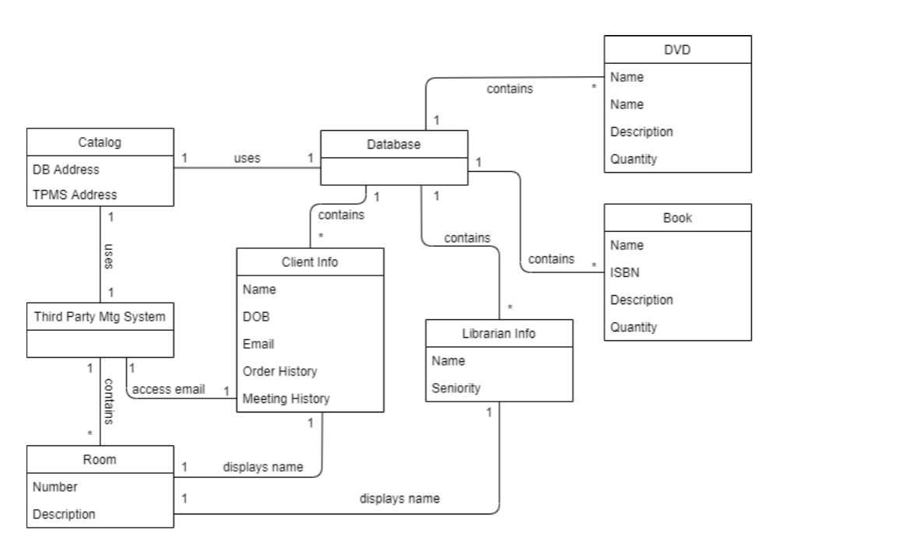
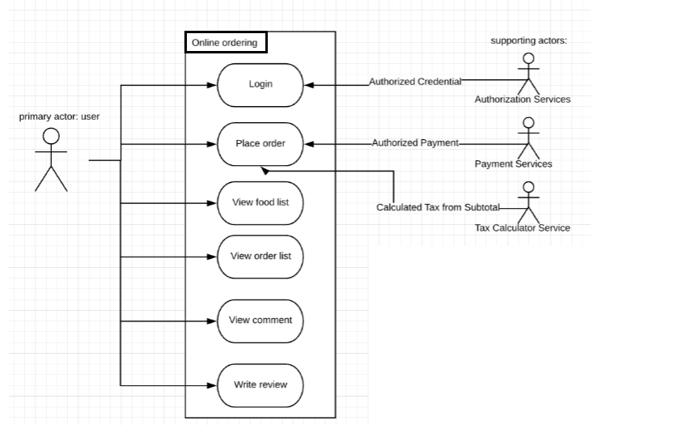
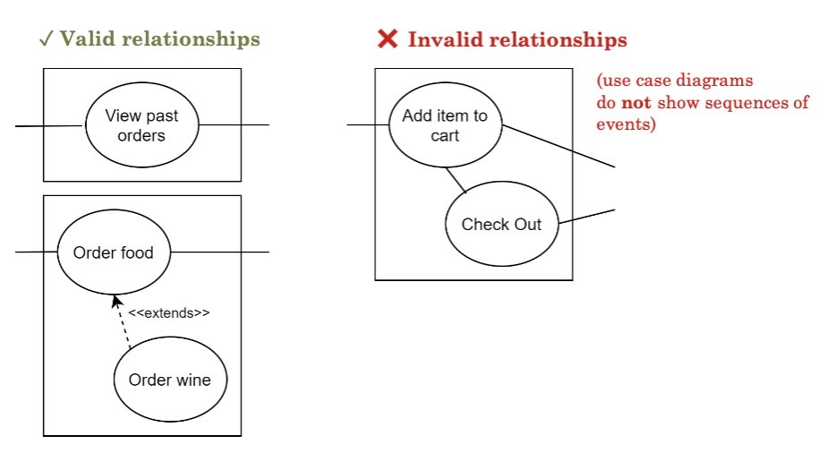
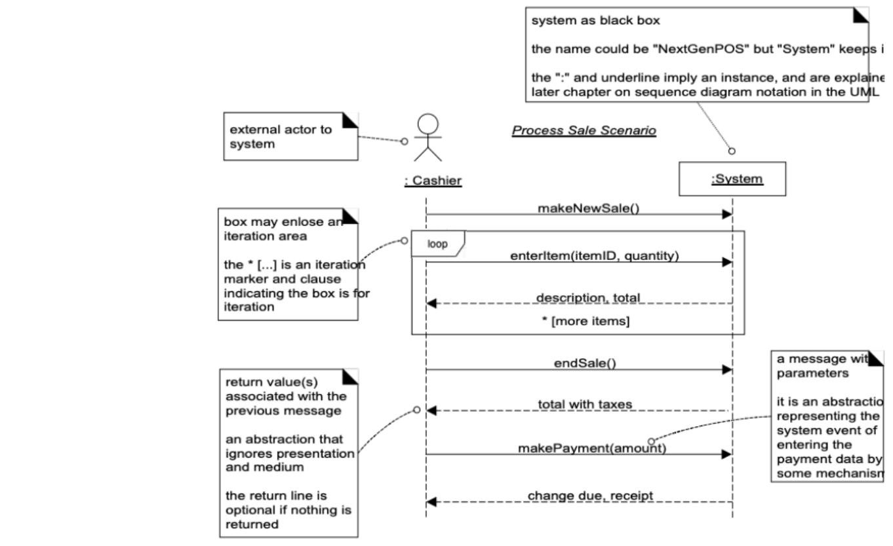

# Exam 1 Diagram Review
## Overview
- multiple choice and diagramming questions
- 3 possible diagrams
	- domain model diagram
	- use case diagram
	- system sequence diagram

## Domain Model
- domain model is a visual representation of conceptual classes
- conceptual classes show relationships and attributes
	- conceptual classes are not software classes
- Note: domain models are read from top to bottom, left to right

### A Good Domain Model Will...
- include each conceptual class involved in the problem
- include possible attributes/data attached to each class
- include meaningful associations between classes that have relationships
- include logical multiplicities for every association

### To Make A Domain Model
1. identify each conceptual class involved in the problem
2. identify possible attributes/data attached to each class
3. identify associations between classes that have relationships
	- start thinking about their multiplicity
4. draw and lay out diagram using above classes/associations
5. add logical multiplicities for every association

### Example Problem: Domain Model
- The library would like a new way to interface with their clients: Catalog++.
- This catalog not only enumerates the library's items but also allows for meetings between the librarians and clients.
- Your task is to design a system that will address the librarians' needs, given the following constraints:
- The Catalog, will use a Database and a Third-Party Meeting System to provide the necessary services.
- It will contain an address to refer to each of these.
- The Database will contain DVDs (each of which have a name, description, and quantity) and Books(name, ISBN, description, quantity). It will also have lists of Client Information and Librarian Information.
- The client info that is stored includes an order and meeting history (to make recommendations), as well as client name, email, and date of birth.
- The librarian info will contain the librarian's name and seniority.
- The Third-Party Meeting System needs to be able to access client information to remind the client of upcoming meetings.
- In addition, it will contain the present number of active Rooms.
- Each room has a name and description.
- In addition, it will display the names of the active librarians and clients in the room.

### Solution

### Tips When Making Domain Models
- there might be possible multiplicities for a single association
	- so pick the one that is most logical and best supported by the problem
- if you are unsure whether to include something, favor adding it
	- it is easier to remove it later than to add it back in

## Use Case Diagram
- use cases are used to identify goals of primary actors
- black-box use cases -> don't worry about how your system will function, just understand what it will do
- include primary and supporting actors
	- primary actors have goals
	- supporting actors provide services

### A Good Use Case Diagram Will...
- display actors
	- primary and supporting
	- correct placement/formatting
- note important/major use cases
- include important relationships between actors
- name use cases properly
- include a system boundary and name
- use inclusion/extension when appropriate

### To Make A Use Case Diagram
1. identify the system name
2. identify the primary actor(s)
3. identify the major use cases
4. identify supporting actors
5. draw and lay out diagram using above actors/use cases
6. add relationships between actors and use cases
	1. or add a relationships between two use cases using \<\<includes\>\> or \<\<extends\>\>

### Example Problem: Use Case Diagram
- You are asked to draw the Use Case diagram of an online food ordering system for a restaurant.
- The system description is given below:
- User of the system must log in before using it.
- After logging in, the user will be able to view a list of food available at the restaurant.
- Customers can read and write reviews to share their opinion about dishes.
- Customer may want to try a new dish but has lost track of what they ate at this restaurant before, it would be great if they can check their order history.
- After choosing carefully, they place the order.

### Solution

### Tips When Making Use Case Diagram
- always draw the system boundary and include a system name
- if you're unsure of whether to include a supporting actor
	- favor adding something you're unsure you need
	- it's easier to remove it later down the line if you decide you don't need it
- think about where the \<\<extends\>\>/\<\<includes\>\> relationships are appropriate
- use cases should always start with a verb
	- ex. "view order list" - good
	- ex. "order list screen" - bad
- use cases should only be connected if they have \<\<extends\>\>/\<\<includes\>\> in the relationship
	- otherwise, use cases should only be connected to actors

## System Sequence Diagram (SSD)
- illustrated interactions that cross the system boundary (input from external actors to black-box systems)
- 1 use case <-> 1 SSD
- examine how the system reacts to external input
	- shows a sequence of events

### A Good SSD Will...
- include the main success scenario
- handle non-linear sequences of events view fragments
- have correct arrows (dotted/solid) and directions
- have proper labeling (title, arrows, etc. labeled correctly)

### To Make An SSD
1. identify the primary actor and use case (usually given)
2. go through the sequence of events and note:
	1. where the sequence starts (usually the primary actor)
	2. the method calls from actor to system
	3. the return values from system to actor
	4. where tasks are repeated until a condition is met (think LOOP)
	5. where events are only done if a condition is met (think ALT/OPT)

### Example Problem SSD
- Primary Actor: Cashier
- Use Case: Process Sale
- Main Success Scenario:
	1. Customer arrives at a POS checkout with goods and/or services to purchase.
	2. Cashier starts a new sale.
	3. Cashier enters item identifier.
	4. System records sale line item and presents item description, price, and running total. Cashier repeats steps 3-4 until indicates done.
	5. System presents total with taxes calculated.
	6. Cashier tells Customer the total and asks for payment.
	7. Customer pays, and System handles payment

### Solution
