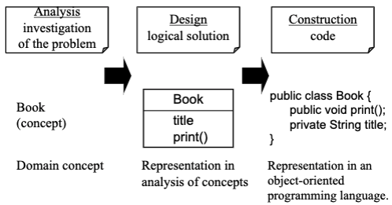
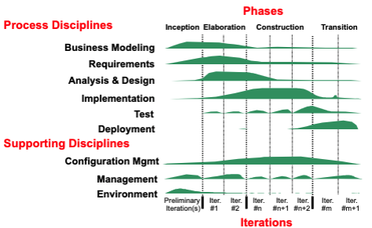

# Objects And Design
- object-oriented analysis (OOA) has an emphasis on finding and describing objects in the problem domain
- object-oriented design (OOD) has an emphasis on defining software objects and their interaction to fulfill the requirements
- low representation gap (using similar templates for each object)

# The Need For Software Blueprints
- knowing an object-oriented language and having access to a library is necessary but not sufficient to create object software
- in between a nice idea and working software, there is much more than programming
- analysis and design provide software "blueprints", illustrated by a modeling language, like the Unified Modeling Language (UML)
	- blueprints serve as a tool for thought and as a form of communication with others

# Object-Oriented Analysis (OOA) vs. Object-Oriented Design (OOD)
## Object-Oriented Analysis (OOA)
- an investigation of the problem (rather than how a solution is defined)
- emphasis placed on finding and describing objects in the problem domain?
	- ex. concepts in an ATM system include a `Bank` and a `Transaction`

## Object-Oriented Design (OOD)
- emphasis on a conceptual solution that fulfills the requirements
- needs to define software objects and how they collaborate to fulfill the requirements
	- ex. in the ATM System, a Transaction software object may have `transactionID` attribute and `getTimestamp` method
- designs are implemented in a programming language
	- ex. the `Transaction` class is made with Java

## From OOA to OOD

# Iterative Development
- **iterations**: development organized into a series of short fixed-length mini-projects; represents a complete development cycle (includes requirements, analysis, design, implementation, and testing)
	- outcome of each iteration is a tested, integrated, and executable system
- an iteration represents a complete development cycle including its treatment of requirements, analysis, design, implementation, and testing activities
- the iterative lifecycle is based on the successive enlargement and refinement of a system through multiple iterations with feedback and adaptation
- multiple iterations allows the system to grow incrementally over time
- the system may not be eligible for production deployment until after many iterations
- the output of each iteration is not an experimental prototype but a production subset of the final system
- each iteration tackles new requirements and incrementally extends the system
- an iteration may occasionally revisit existing software and improve it
- **iterative development**: the life of a system stretching over a series of cycles, each resulting in a product release

## Unified Process (UP)
- **process**: a set of partially ordered steps intended to reach a goal
- in software engineering, the goal is to efficiently and predictably deliver a software product that meets the needs of your business
- **software development process**: an approach to building, deploying, and maintaining software
- for simple systems, it may be feasible to sequentially design the entire problem
- for complex systems, the linear approach is not realistic
- **Unified Process (UP)**: a process for building object-oriented systems
	- the goal is to enable the production of high-quality software that meets users needs within predictable schedules and budgets
	- promotes iterative development

## Embracing Change
- stakeholders usually have changing requirements
- each iteration involves choosing a small subset of requirements and quickly designing, implementing, and testing them
- this leads to rapid feedback, and an opportunity to modify or adapt understanding of the requirements or design

## Iteration Length And Timeboxing
- UP recommends short iteration lengths to allow for rapid feedback and adaptation
- long iterations increase project risk
- iterations are fixed in length (timeboxed)
	- if a meeting deadline seems to be difficult, then tasks or requirements are removed from the current iteration and pushed to a future iteration
- UP recommends an iteration be between 2 to 6 weeks

## Phases Of The Unified Process
1. **inception**: define the scope of the project
2. **elaboration**: plan project, specify features, baseline architecture
3. **construction**: build the project
4. **transition**: transition the product into the end-user community

## Iterations And Milestones
- each phase and iteration has some risk mitigation focus and concludes with a well-defined milestone
- the milestone review provides a point in time to assess how well key goals have been met and whether the project needs to be restructured in any way to proceed
- the end of each iteration is a minor release, a stable executable subset of the final product

## UP Disciplines
- an iteration includes work from most disciplines but the emphasis on each change in the phase
	- early iterations focus more on requirements and design (than later iterations)

## Disciplines And Phases
- although an iteration includes work in most disciplines, the relative effort and emphasis change over time
	- early iterations tend to apply greater emphasis to requirements and design
- Note: many activities and artifacts are optional but some UP practices and principles are invariant including:
	- iterative and risk-driven development
	- continuous verification of quality

## Advantages Of An Iterative Process
- reduces risk
	- risks are identified early, progress is easier to see
- get a robust architecture
	- architecture can be assessed and improved early
- handle evolving requirements
	- users provide feedback to operational systems
	- responding to feedback is an incremental change
- allow for changes
	- system can adapt to problems
- attain early learning
	- everyone obtains an understanding of the different workflows early on