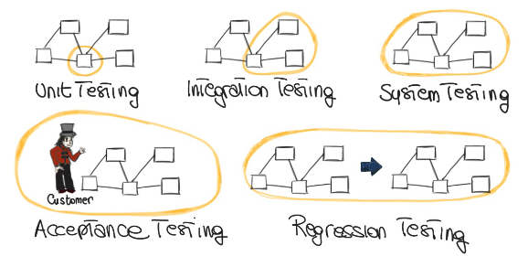
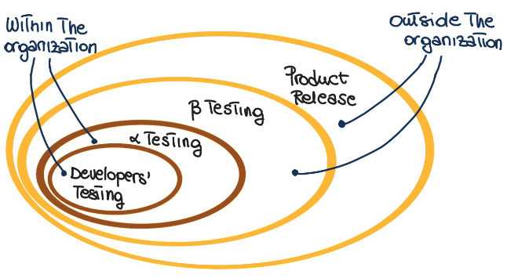
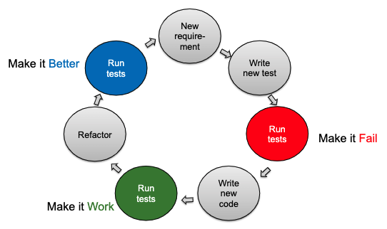

# Failure, Fault, Error
- **failure**: observable incorrect behavior of a program; conceptually related to the behavior of the program
- **fault (bug)**: related to the code; necessary (not sufficient) for the code
- **error**: cause of a fault; usually a human error (conceptual, type, etc.)

# Approaches To Verification
- **testing**: exercising software to try and generate failures
- **static verification**: identity specific problems statically (considering all possible executions)
- **inspection/review/walkthrough**: systematic group review of program text to detect faults
- **formal proof**: proving that the program text implements the program specification

# What Is Testing?
- **testing**: to execute a program with a sample of the input data
	- a dynamic technique and optimistic approximation

## Testing Granularity Levels

- **acceptance testing**: sign contract with the user
- regression testing
- developers' testing
- **alpha testing**: testing within the same organization; hopefully iron out all major bugs, QA team inside company, real clients (internal users of the software)
- **beta testing**: inquire 3rd party testers, fix additional bugs

# Test-Driven Development (TDD)
- test is written before the class to be tested and the developer writes unit testing code for nearly all production code
- write test code (code that fulfills requirements)
- write functional code (working code that fulfills requirements)
- refactor (clean working code that fulfills requirements)

## Unit Testing
- make it fail (no code without a failing test)
- make it work (as simply as possible)
- make it better (with refactoring)

## Why TDD?
- imposes developers' discipline
- provides incremental specification
- avoid regression errors
- allows for changing with confidence

## Structure Of Tests
- set fixture
- invoke
- check
- cleanup

## Infrastructure For Unit Testing
- **XUnit**: automated unit testing frameworks
	- available for multiple languages & environments
		- JUnit (Java)
		- cppUnit (C++)
		- nUnit (.NET languages)
		- dbUnit (database testing)
		- HTTPUnit (testing websites)
		- PHPUnit (testing PHP)
	- acts as a driver
	- automates test runs
	- automates result checks