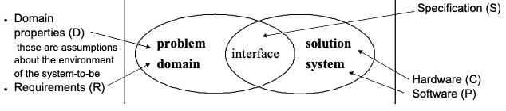
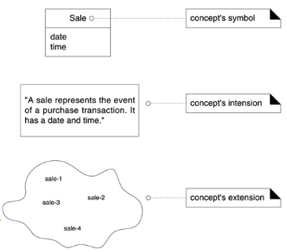
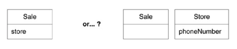
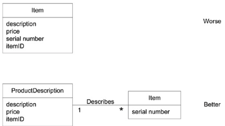
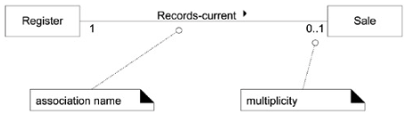
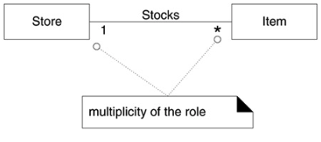
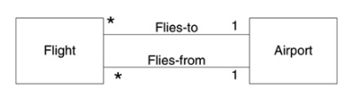
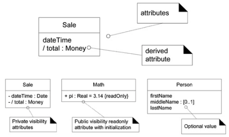
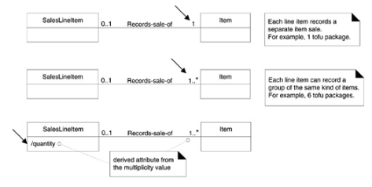
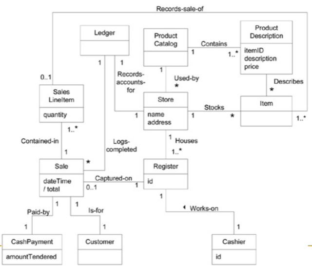

# Introduction To Requirements Engineering
- **requirements**: system capabilities and conditions to which the system must conform
- functional requirements
	- features and capabilities
	- recorded in the Use Case Model
- non-functional (quality requirements)
	- usability (help, documentation, etc)
	- reliability (frequency of failure, recoverability, etc)
	- performance (response times, availability, etc)
	- supportability (adaptability, maintainability, etc)
	- recorded in the Use Case Model or in the Supplementary Specifications artifact
- the nature of UP supports changing requirements

## How Are Requirements Organized In UP Artifacts
- use case model
	- a set of typical scenario of using a system
	- primarily for functional requirements
- supplementary specification
	- everything not in the use cases
	- primarily for non-functional requirements
- glossary (noteworthy terms)
- vision
	- high-level requirements from the use case model and Supplementary Specification
- business rules (domain rules)
	- ex. government tax laws

## Where Do Requirements Come From?
- stakeholders
- application domain
- documentation

## Elicitation Problems
- thin spread of the domain knowledge
- knowledge is tacit
- limited observability
- bias

## Traditional Techniques
- background reading
- hard data and samples
- interviews
- surveys
- meetings

## Analyzing Requirements
- verification
- validation
- risk analysis

## Requirements, Verification, And Validation
- requirements validation
	- check that the right product is being built
	- ensures that the software being developed (or changed) will satisfy its stakeholders
	- checks the software requirements specification against stakeholders’ goals and requirements
- requirements verification
	- check that product is being built right
	- ensures that each step followed in the process of building the software yields the right products
	- checks consistency of the software requirements specification artifacts and other software development products (design, implementation, etc) against the specification

## The World And The Machine
- **validation question**: if the domain-to-be (excluding the system-to-be) has the properties D, and the system-to-be has the properties S, then the requirements R will be satisfied
	- D and S => R
- **verification question**: if the hardware has the properties H, and the software has the properties P, then the system requirements S will be satisfied
	- D and C and P => R

## Requirements Prioritizations
- limited resources -> inability to satisfy al lthe requirements -> need to prioritize
	- mandatory
	- nice to have
	- superfluous

## Requirements Engineering Iterative Process
1. elicitation
2. negotiation
3. modeling
4. analysis

---
# Domain Models
- **domain model**: a visual representation of conceptual classes or real-situation objects in a domain; illustrates meaningful concepts in a problem domain
	- does not show software classes
	- software artifacts, responsibilities, or methods are not suitable in a domain model
	- is a set of static structure diagrams, no operations are defined
- a domain model may show
	- domain objects or conceptual classes
	- associations between conceptual classes
	- attributes of conceptual classes

## Conceptual Classes
- **conceptual classes**: has a symbol, inclusion, and extension

## How To Create A Domain Model
1. find the conceptual classes
2. draw them as classes in a UML diagram
3. add associations and attributes

## Strategies For Finding Conceptual Classes
- reuse or modify existing models
- use a category list
- identify noun phrases

## Using Noun Phrase Identification
- identify nouns and noun phrases and consider them as candidate conceptual classes or attributes
- however, be careful...
	- mechanical noun-to-class mapping is not possible
	- words may be ambiguous

## Attributes vs. Classes
- if we do not think of some conceptual class X as a number or text in the real world, X is probably a conceptual class

- Note: the diagram on the right is correct because we would not think of a store as a number or text in the real world

## Description Classes
- **description class**: contains information that describes something else
- add description classes when:
	- there needs to be a description about an item or service, independent of the current existence of any examples of those items or services
	- deleting instances of items they describe, resulting in a loss of information that needs to be maintained
	- reduces redundant information

## Association
- **association**: relationships between classes that indicates some meaningful connection
- name an association based on `ClassName` `VerbPhrase` `ClassName` format
	- ex. `Sale` paid-by `CashPayment`

### Roles And Multiplicity
- each end of an association is called a role
- roles may have
	- multiplicity expression
	- name
	- navigability

### Multiple Associations
- two classes may have multiple associations between them in a UML class diagram

## Attributes
- **attribute**: a logical data value of an object
	- are shown in the second compartment of the class box
- include attributes that the requirements suggest or imply a need to remember information

### Domain Model Example
