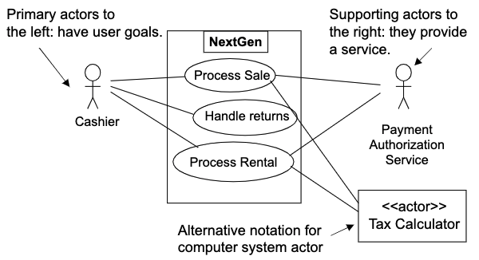

# Use Cases
- **use cases**: text stories used to discover and record requirements
- black-box use cases describe system responsibilities (ex. define what the system must do)
- use cases may be written in three formality types
	- brief: one paragraph summary (usually main success scenario)
	- casual: informal paragraph
	- fully dressed: elaborate; all steps and variations are written in detail

## Definitions
- **actor**: something with behavior, such as a person, computer system, or organization
- **scenario**: specific sequence of actions and interactions between actors and the system under discussion
- **use case**: a collection of related success and failure scenarios that describe actors using a system to support a goal

## Use Case Modeling
- use case model is defined within the requirements discipline in UP
- use case model is a set of all written use cases
- use case model may optionally include a use case diagram

## Use Cases And Adding Value
- a key point is to focus on the question "how can using the system provide observable value to the use, or fulfill their goals?"
- use cases mainly constitute functional requirements

## 3 Kinds Of Actors
- primary actor
	- has user goals fulfilled through using service of the system under design (SuD)
- supporting actor 
	- provides a service (ex. information) to the SuD
- offstage actor
	- has an interest in the behavior of the use case

## Goals And Scope Of A Use Case
- focus on use cases at the level of elementary business process

## Finding Primary Actors, Goals, And Use Cases
- choose the system boundary
- identify primary actors (those that have user goals fulfilled through using services of the system)
- for each actor identify their user goals
- define use cases that satisfy user goals and name them according to their goal
	- EPB test, boss test, size test

## Determining Validity Of Use Cases
- **elementary business process (EBP)**: a task performed by one person in one place at one time which adds measurable business value and leaves the data in a consistent state
	- ex. approve credit order -> CORRECT
	- ex. negotiate a supplier contract -> INCORRECT
- **boss test**: what have you been doing all day
- **size test**: use typically contains many steps as opposed to a single step within a series of steps

## Essential vs. Concrete Style
- essential -> focus is on intent
	- avoids making UI decisions
- concrete -> UI decisions are embedded in the use case text
	- ex. admin enters ID and password in the dialog box (see picture X)
	- not suitable during early requirements analysis work

