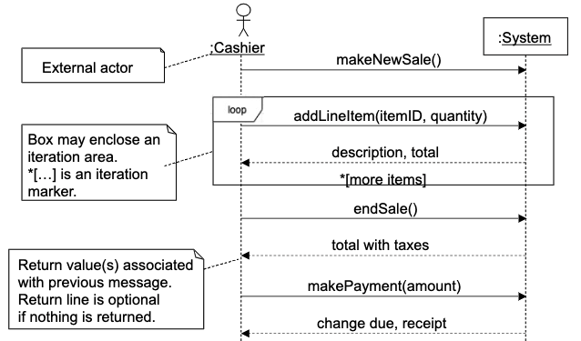
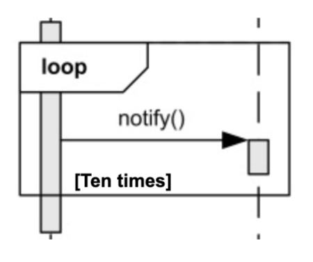
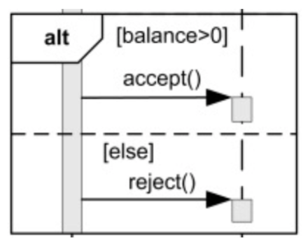
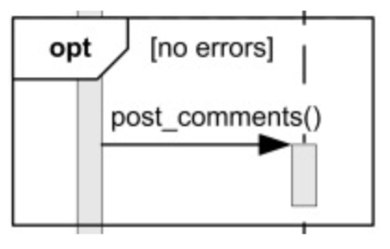
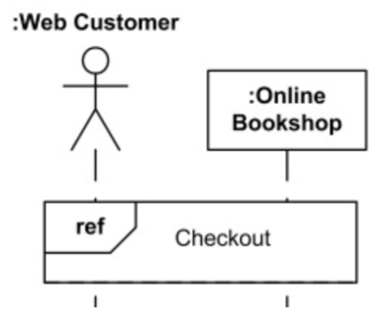

# System Behavior And System Sequence Diagram (SSD)
- **sequence diagram**: a picture that shows (for a particular scenario of a use case), the events that external actors generate, their order, and possible inter-system events
- all systems are treated as a black box
- the diagram places emphasis on events that cross the system boundary from actors to systems

## SSD Example
- simple cash-only process sale scenario
	- `Customer` arrives at POS checkout with goods to purchase
	- `Cashier` starts a new sale
	- `Cashier` enters item identifier
	- `System` records sale line item and presents item description, price, and running total
		- `Cashier` repeats this step until done
	- `System` presents total with taxes calculated

## Naming System Events And Operations
- the set of all required system operations is determined by identifying the system events
	- ex. `makeNewSale()`, `addLineItem(itemID, quantity)`, `endSale()`

## System Sequence Diagrams: Fragments
- manage complex interactions with sequence fragments
	- loop -> iteration
	- alt -> alterations
	- opt -> option
	- ref -> reference

### Loop

- calls notify() 10 times

### Alternatives

- calls accept() if balance > 0
- calls reject() otherwise

### Option

- post comments if there were no errors

### Reference

- Web customer and Bookshop use (reference) interaction Checkout

## SSDs Within The Unified Process
- SSDs are not usually motivated in inception
- most SSDs are created during elaboration