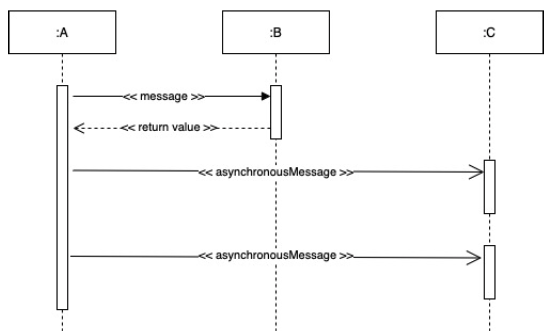
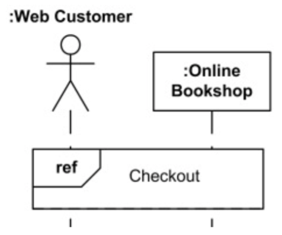

# Robustness Diagram
- bridges the "what/how" gap from the use case model to code


# Drawing Robustness Diagrams
## Robustness Diagram Notation


## Robustness Diagram Rules


- nouns can talk to verbs, verbs can talk to nouns
- nouns can't talk to other nouns
- verbs can talk to other verbs

## Valid Relationship Example


- an actor can talk to a boundary object
- boundary objects and controllers can talk to each other (noun <-> verb)
- a controller can talk to another controller (verb <-> verb)
- controllers and entity objects can talk to each other (verb <-> noun)

## Invalid Relationship Example


- an actor can't talk directly to a controller or entity (must talk to a boundary object)
- boundary objects and entity objects can't talk directly to each other (must go through a controller)
- entities can't talk directly to other entities (must go through a controller)
- boundary objects can't talk directly to other boundary objects (must go through a controller)

# Robustness Analysis Guidelines
- paste the use case text directly onto your robustness diagram
- take your entity classes from the domain model and add any that are missing
- expect to rewrite (disambiguate) your use case while drawing the robustness diagram
- make a boundary object for each screen and name your screens unambiguously
- remember that controllers are only occasionally real controller objects
	- they are more typically logical software functions
- don't worry about the direction of the arrows on a robustness diagram
- it is okay to drag and use case onto a robustness diagram
- boundary and entity classes on a robustness diagram will generally become object instances on a sequence diagram, while controllers will become messages
- remember that robustness diagram is an "object picture" of a use case, whose purpose is to force refinement of both use case text and the object model

---
# Sequence Diagrams (SD)
## SD Example


```
public class A {
	private B myB = new B();
	
	public void doOne() {
		myB.doTwo();
		myB.doThree();
	}
	
	// some more code...
}
```

## Illustrating Returns


## Messages To `self` or `this`


## Synchronous vs. Asynchronous Messages


## Sequence Diagrams: Fragments
- manage complex interactions with sequence fragments
	- loop -> iteration
	- alt -> alterations
	- opt -> option
	- ref -> reference

### Loop


- calls notify() 10 times

### Alternatives


- calls accept() if balance > 0
- calls reject() otherwise

### Option


- post comments if there were no errors

### Reference


- Web customer and Bookshop use (reference) interaction Checkout