# Object-Oriented Design
- emphasizes a conceptual solution that fulfills the requirements
- need to define software objects and how they collaborate to fulfill the requirements
	- ex. in the Library Information System, a *Book* software object may have a *title* attribute and a *getChapter* method
- designs are implemented in a programming language
	- ex. we will have a *Book* class in Java.

## From Design To Implementation
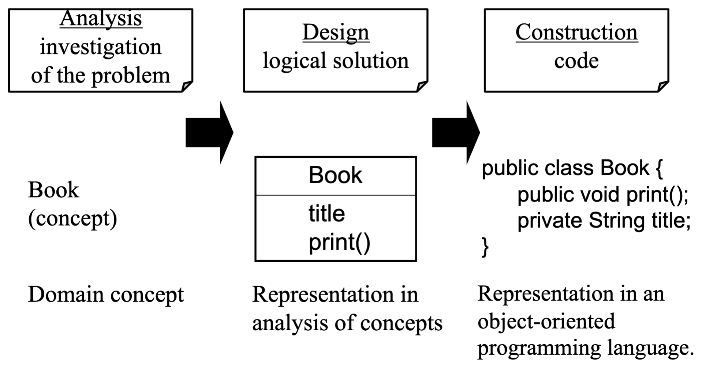

# Design Class Diagrams (DCD)
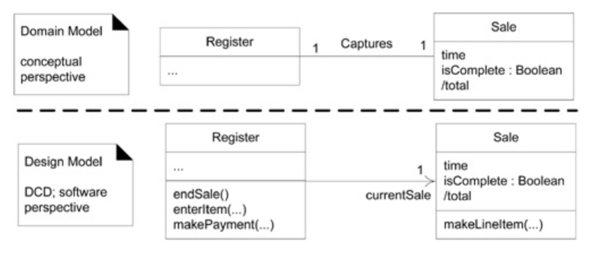

- Note: DCD shows software entities while Domain Models show real-world entities (DCD vs Domain Model)

## When To Create DCDs
- once the interaction diagrams have been completed it is possible to identify the specification for the software classes and interfaces
- a class diagram differs from a Domain Model by showing software entities rather than real-world concepts
- the UML has notation to define design details in static structure, or class diagrams.

## Class Attributes
- full format:
	- `visibility name` : `type multiplicity` = default {property-string}
- visibility marks:
	- `+` (public), `-` (private), `#` (protected)
- attributes assumed private if no visibility is given
- operations assumed public if no visibility is given

## Attribute Text vs. Association Line Notation For An Attribute
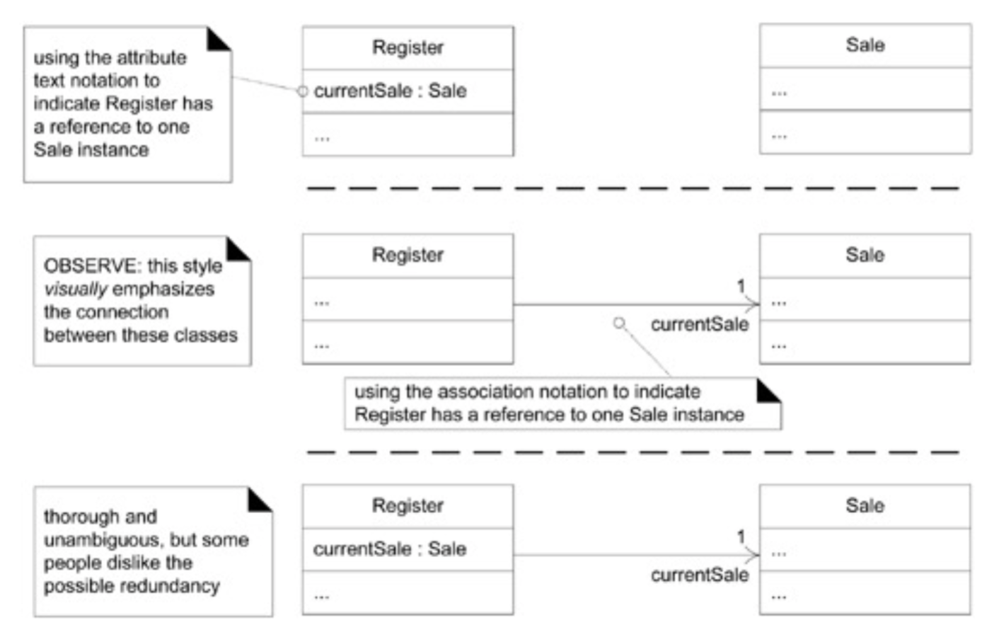

## Idioms In Association Notation Usage In Different Perspectives
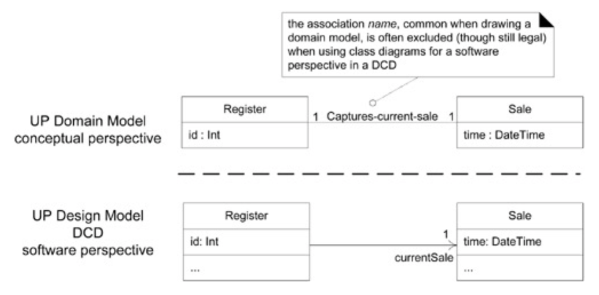

## When to Use Attribute Text vs. Association Lines for Attributes
- guideline:
	- use the attribute text notation for data type objects
	- use the association line notation for others
- common data types: 
	- Boolean, Date, Number, Character, String (Text), SSN, ZIP, Phone #, etc.

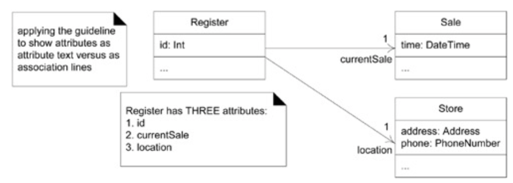
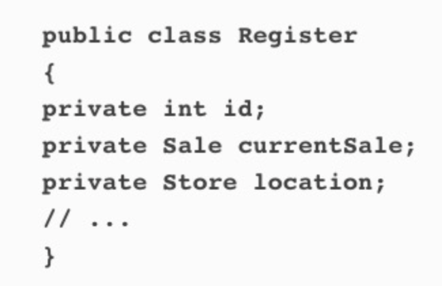

## The UML Notation For An Association End
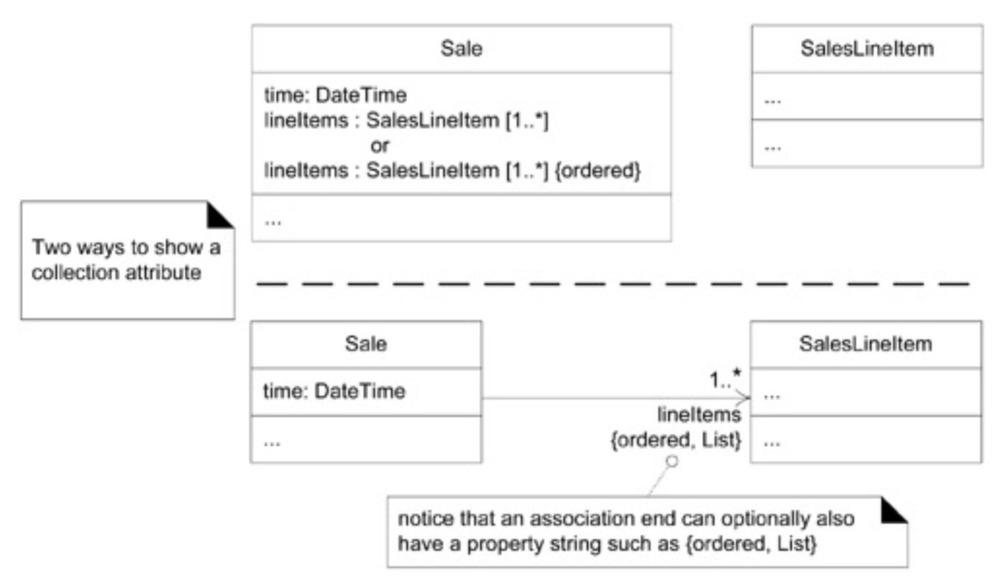

## Note Symbols
-   a note symbol may represent several things
	-   UML note or comment
	-   UML constraint
	-   method body

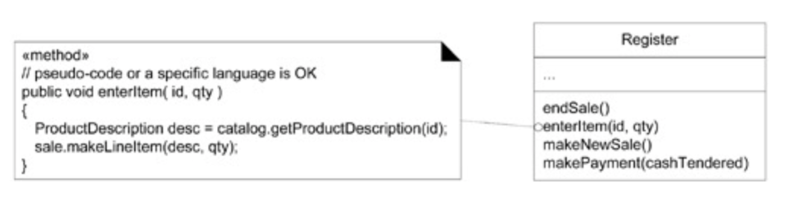

## Operations and Methods
- operation syntax, UML1:
	- visibility name (parameter-list) : return-type {property-string}
- operations are usually assumed public if no visibility is shown
- operations to access attributes are often excluded

## UML Keywords
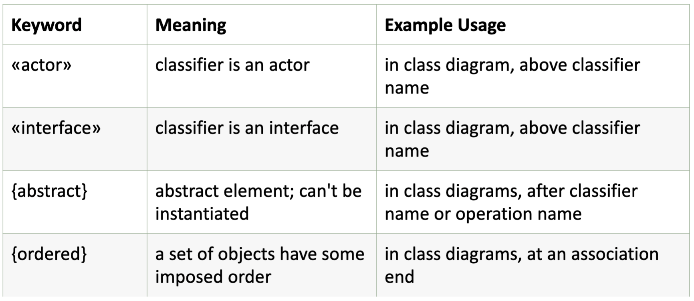

## Dependency
- you want low-coupling across classes because it allows for easier refactoring when dependencies change (if you touch something in one class, it doesn't greatly affect the other class)

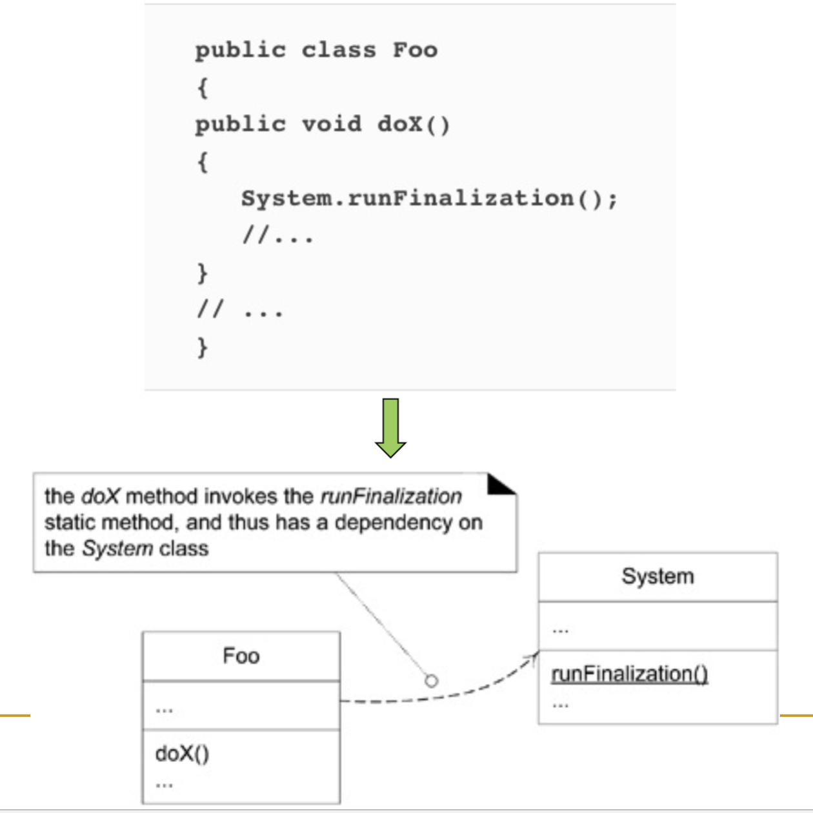

## Optional Dependency Labels
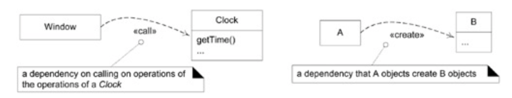

## Interfaces
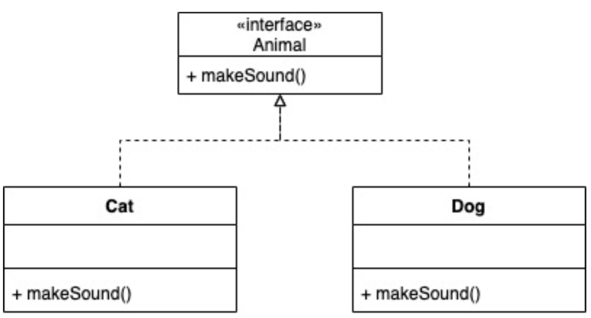

## Inheritance
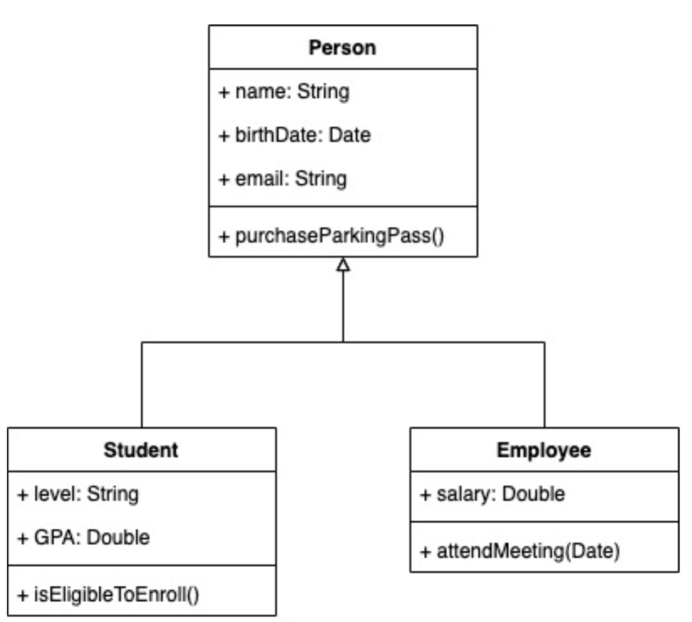
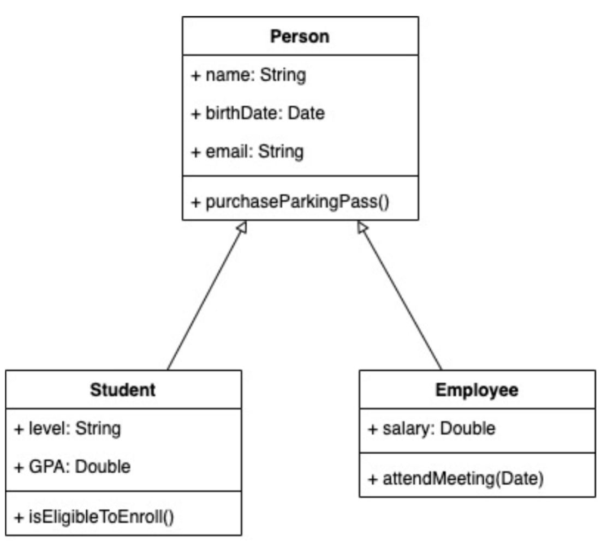

## Abstract Class
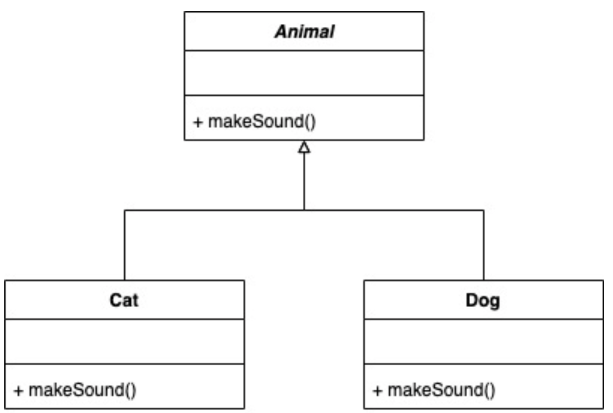

## Composition Over Abstraction
- **aggregation**: “has-part” association relationship; hollow diamond shape

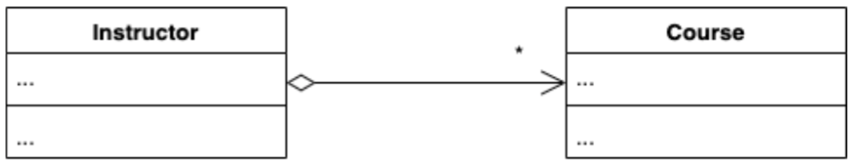

- **composition**: whole-part association relationship; filled diamond shape

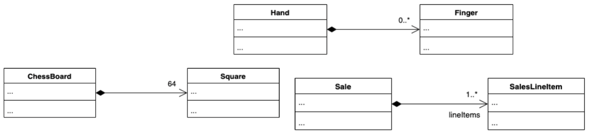

## Constraints
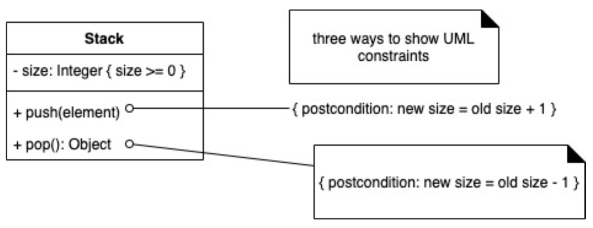

## Utility Class
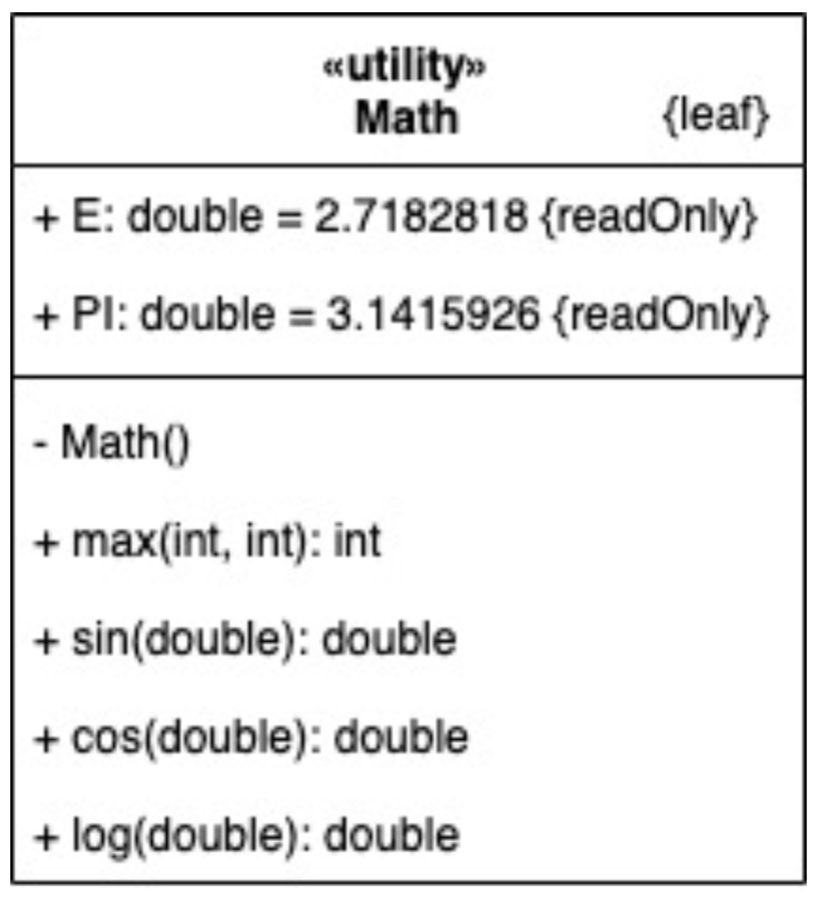

- the {leaf} notation means that this class can have no children

## Association Class
- many to many relationship

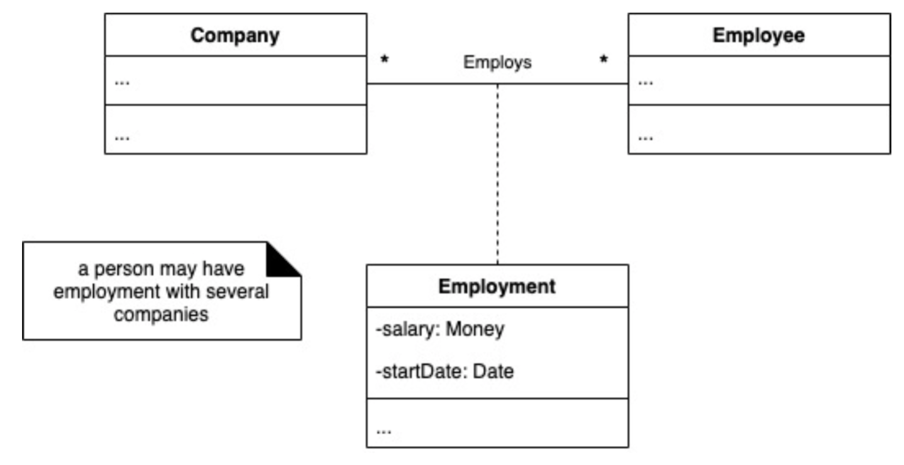