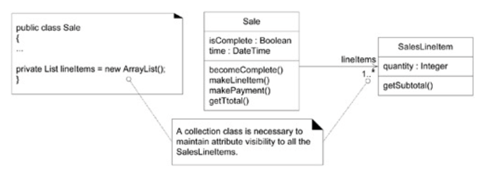
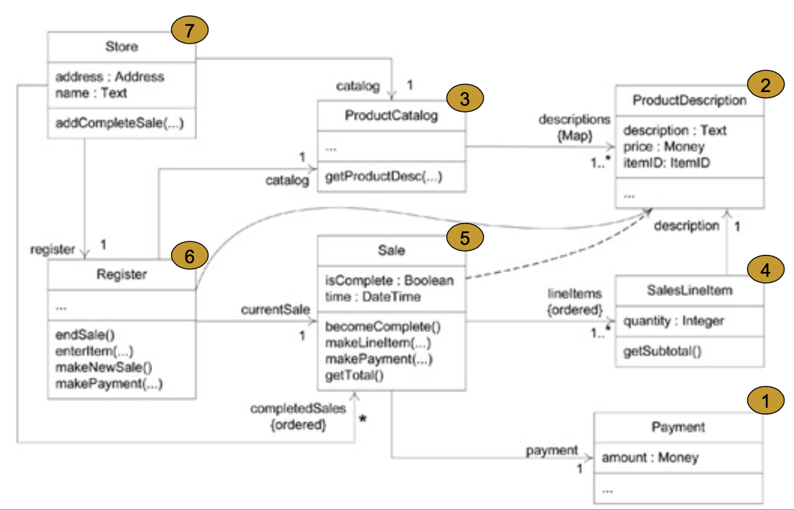

# Visibility Between Objects
- **visibility**: the ability of one object to see or have reference to another

# Types Of Visibility
- four common ways that visibility can be achieved from object A to object B
	- attribute visibility: B is an attribute of A
	- parameter visibility: B is a parameter of a method in A
	- local visibility: B is a (non-parameter) local object in a method of A
	- global visibility: B is globally visible

## Attribute Visibility
- attribute visibility from A to B exists when B is an attribute of A
- relatively permanent visibility
- common form of visibility in object oriented systems

## Parameter Visibility
- parameter visibility from A to B exists when B is passed as a parameter to a method of A
- relatively temporary visibility
- it is common to transform parameter visibility into attribute visibility

## Local Visibility
- local visibility from A to B exists when B is declared as a local object within a method of A
- relatively temporary visibility
- two common means by which local visibility are achieved are:
	- creating a new local instance and assigning it to a local variable
	- assign the returning object from a method invocation to a local variable

## Global Visibility
- global visibility from A to B exists when B is global to A
- the preferred method to achieve global visibility is to use the singleton pattern

# Creating Class Definitions From Design Class Diagrams (DCD)
- one-to-many relationships are common
	- ex. a `Sale` must maintain visibility to a group of many `SalesLineItem` instances

# Order Of Implementation
- start implementing from the least amount of dependencies (least coupled to most coupled)

