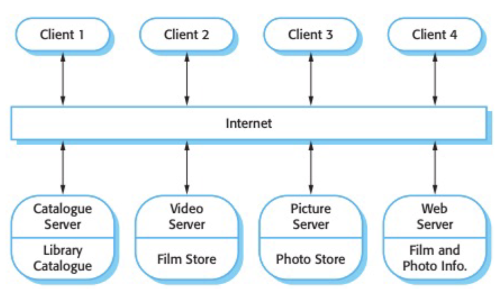
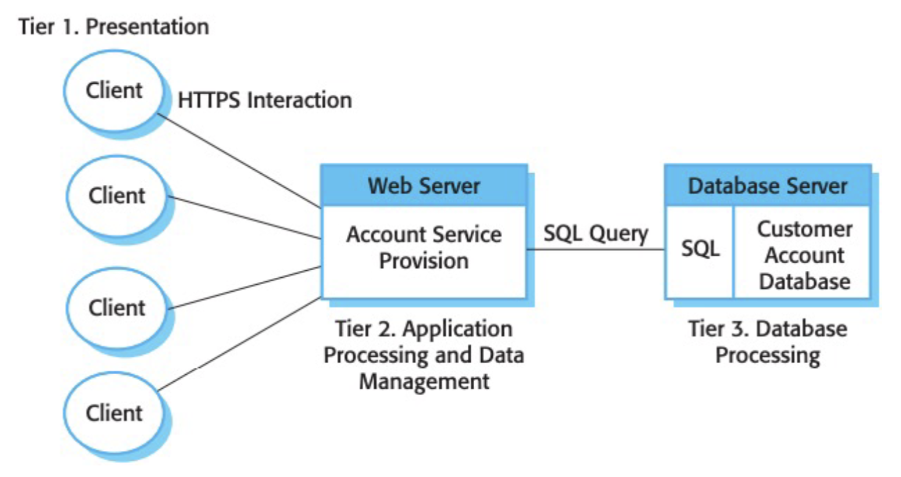
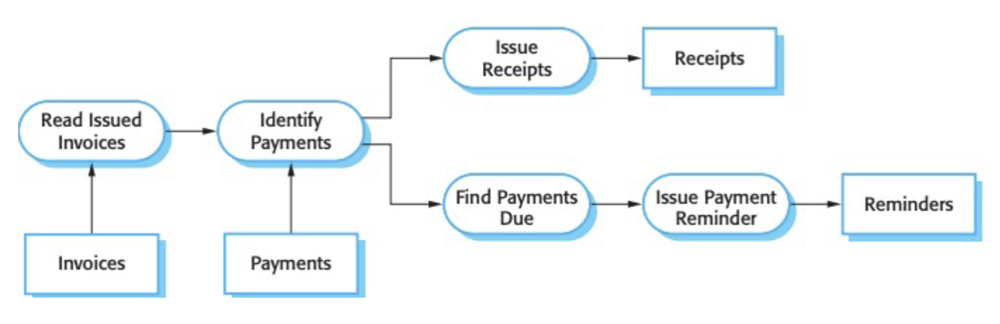
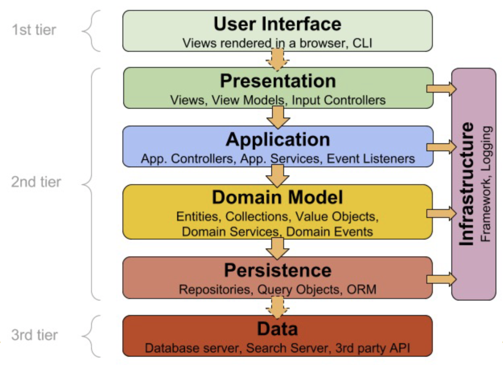
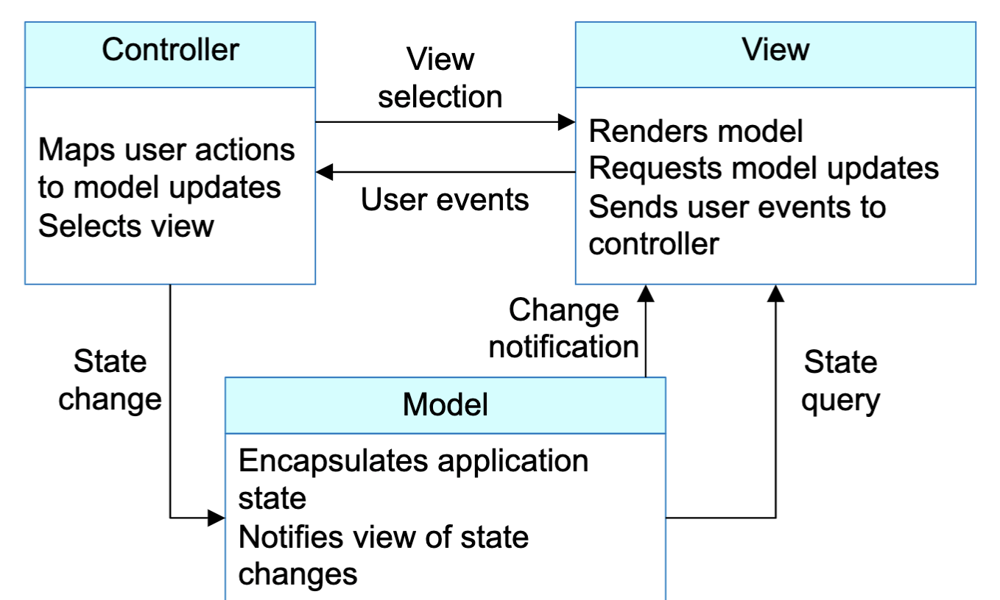
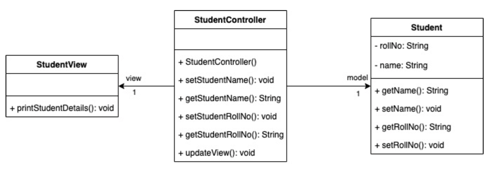

# Misconception About Software Architects
- software architects as architecture astronauts
	- a senior person in a software organization who set standards on how software should be written but hasn't written code in decades

# Software Architecture
- (ANSI/IEEE STD 1471-2000)
	- the fundamental organization of a system, embodied in its components, their relationships to each other and the environment, and the principles governing its design and evolution 
- (Ralph Johnson)
	- expert developers' understanding of the system design
- general definition
	- the set of design decisions that must be made early
	- the decisions that you wish you could get early on
	- the decisions that are hard to change
- Note: `shared understanding + hard to change = important stuff`

# Importance Of Software Architecture
- economics point of view
	- "we need to put less effort on quality so we can build more features for our next release"
- craftsmanship point of view
	- "we need to stand up to our professional standards"
- this argument is presented as a trade-off between quality and cost
	- but economics always wins
- external qualities (pleasant user interface, fewer defects)
- internal quality (good modular design)

# Design Stamina Hypothesis
- there exists a design payoff line...
	- below the line, no design > good design (worth trading off design quality for time to market)
	- above the line, good design > no design (no useful trade-off)
- Note: in the long term, good design is better

# Architectural Views
- **view**: a representation of a set of system elements and their associated relations
- views are representations of the structures present simultaneously in software systems
- views are used to describe architecture
- software architecture includes {elements, forms, rationale/constraints}

# Common Architectural Styles
- n-tier
	- client - server
- peer-to-peer
- blackboard/shared memory
- pipe and filter
- layered
	- model - view - controller
- implicit invocation/event-driven

# Client-Server Architecture
- a system is organized as set of services and associated servers, and clients that access and use the services
-  major components
	-  set of servers that offer services to other components (ex. print servers, file server, email servers)
	-  set of clients that call on the services offered by servers
	-  a network that allows the clients to access these services



- advantages
	-  a distributed architecture
	- general functionality can be available to all clients and does not need to be implemented by all services
		- ex. a printing service
- disadvantages
	- each services is a single point of failure so susceptible to denial of service attacks or server failure

# n-tier Architecture
- fundamental problem with client-server architecture is that logical layers in the system (presentation, application processing, data management, and database) must be mapped onto two computer systems: client and server
- the different layers of the system are separate processes that may execute on different processors



# Peer-To-Peer Architecture
- peer-to-peer (P2P) systems are decentralized systems in which computations can be carrier out by any node on the network
- no clear distinction between client and servers
- ex. Gnutella and BitTorrent, ICQ and Jabber, SETI@home, Skype
- P2P is appropriate in 2 circumstances
	- where the system is computationally intensive, and it is possible to separate the processing required into large number of independent computations
	- where the system involves the exchange of information between individual computers on a network and there is no need for this information to be centrally stored or managed
- advantages
	- highly redundant (both fault-tolerant and tolerant of nodes disconnecting from the network)
- disadvantages
	- concerns about issues of security and trust
	- peers may behave in a malicious way

# Blackboard/Shared Memory Architecture
- a common knowledge base (blackboard) is iteratively updated by a diverse group of specialist knowledge sources, starting with a problem specification and ending with a solution
- each knowledge source updates the blackboard with a partial solution
	- the specialists work to solve the problem like this
- key ideas are that the problem solving should be both:
	- **incremental**: complete solutions are constructed piece by piece and at a different level of abstraction
	- **opportunistic**: system choose the actions to take the next that will allow it to make the best progress
- blackboard model defines three main components:
	- **blackboard**: a structured global memory containing objects from the solution space
	- **knowledge sources**: specialized modules with their own representation
	- **control component**: selects, configures, and executes modules

## Blackboard/Shared Memory Architecture Metaphor
- a group of specialists in a room with a blackboard
- work as a team to brainstorm a solution to a problem using the blackboard as the workplace
- specialists look for an opportunity to apply their expertise to the developing solution
- when someone writes on the blackboard that allows another specialist to apply their expertise

# Pipe And Filter Architecture
- processing of data in a system is organized so that each processing component (filter) is discrete and carriers out one type of data transformation
- data flows (like in a pipe) from one component (filter) to another for processing
- name 'pipe and filter' comes from Unix where it is possible to link processes using 'pipes'
- advantages
	- easy to understand and supports transformation reuse
	- workflow style matches the structure of many business processes
	- evolution by adding transformations is straightforward
	- can be implemented as either a sequential or concurrent system
- disadvantages
	- format for data transfer has to be agreed upon between communicating transformations
	- each transformation must parse its input and unparse its output to the agreed form
		- this increases system overhead and may mean that it is impossible to reuse functional transformations that use incompatible data structures



## Working With Pipes In Unix
- how many directories under `/etc` are writable by root
	- `sudo ls -IR | grep drwx`
- results are too long to list, but we can pipe the results of the command to the word count (wc) command
	- `sudo ls -IR | grep drwx | wc -l`

# Layered Architecture
- organizes the system into layers with related functionality associated with each layer
- in each layered system, each layer:
	- depends on the layers beneath it
	- is independent of the layers on top of it, having no knowledge of the layers using it
- advantages
	- we only need to understand the layers beneath the one we are working on
	- each layer is replaceable by an equivalent implementation, with no impact on the other layers
	- a layer can be used by several different higher-level layers
- disadvantages
	- layers cannot encapsulate everything
	- coupling of code over time
	- considerable amount of time to build/test/deploy



# Model-View-Controller (MVC) Pattern
- follows the layered approach
- separates presentation and interaction from the systems data
- system is structured into three logical components that interact with one another
	- **model component**: manages the system data and associated operations on the data
	- **view component**: defines and manages how the data is presented to the user
	- **controller component**: manages user interaction (ex. key presses, mouse clicks, etc.)



## MVC Example: Class Diagram


## MVC Example: Model
```
public class Student {
	private String rollNo;
	private String name;
	
	public String getRollNo() {
		return rollNo;
	}
	
	public void setRollNo(String rollNo) {
		this.rollNo = rollNo;
	}
	
	public String getName() {
		return name;
	}
	
	public void setName(String name) {
		this.name = name;
	}
}
```

## MVC Example: View
```
public class StudentView {
	public void printstudentDetails(String studentName, String studentRollNo) {
		System.out.println("Student: ");
		System.out.println("Name: " + studentName);
		System.out.println("Roll No: " + studentRollNo);
	}
}
```

## MVC Example: Controller
```
public class StudentController {
	private Student model;
	private StudentView view;
	
	public StudentController(Student model, StudentView view) {
		this.model = model;
		this.view = view;
	}
	
	public void setStudentName(String name) {
		model.setName(name);
	}
	
	public String getStudentName() {
		return model.getName();
	}
	
	public void setStudentRollNo(String rollNo) {
		model.setRollNo(rollNo);
	}
	
	public String getStudentRollNo() {
		return model.getRollNo();
	}
	
	public void updateView() {
		view.printStudentDetails(model.getName(), model.getRollNo());
	}
}
```

## MVC Example: Demo
```
public class MVCPatternDemo {
	public static void main(String[] args) {
		// fetch student record based on her roll no from the database
		Student model = retrieveStudentFromDatabase();
		
		// create a view : write student details on console
		StudentView view = new StudentView();
		StudentController controller = new StudentController(model, view);
		controller.updateView();
		
		// update model data
		controller.setStudentName("John");
		controller.updateView();
	}
	
	private static Student retrieveStudentFromDatabase() {
		Student student = new Student();
		student.setName("Robert");
		student.setRollNo("10");
		return student;
	}
}

/*
	OUTPUT:
	
	Student:
	Name: Robert
	Roll No: 10
	Student:
	Name: John
	Roll No: 10
*/
```

# Implicit Invocation/Event-Driven Architecture (EDA)
- traditionally, components interact with each other by explicitly invoking routines
- with implicit invocation, instead of invoking a procedure directly, a component can announce (broadcast) one or more events
- other components register an interest in an event
- when the event is announced, the system invokes all the interested procedures

# Other Architectures
- Simple Object Access Protocol (SOAP)
	- XML-based messaging protocol for web services
- Microservice Architecture (MSA)
	- arranges an application as a collection of loosely coupled services