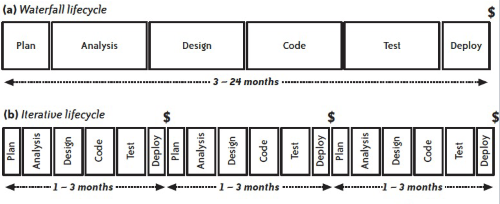
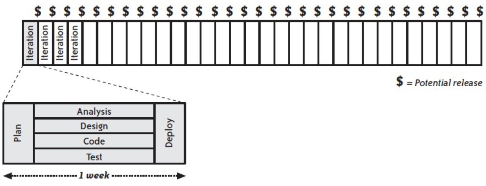
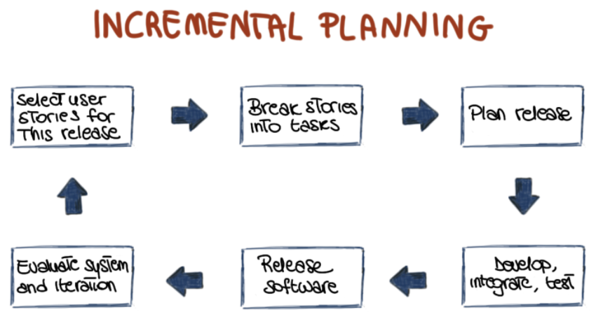
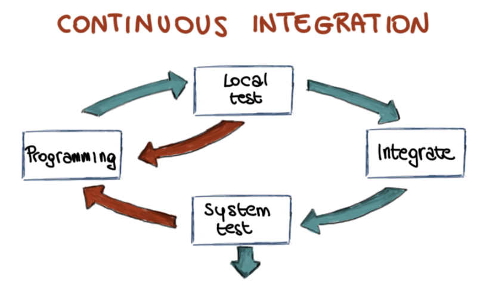
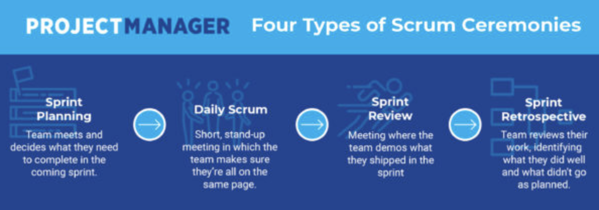
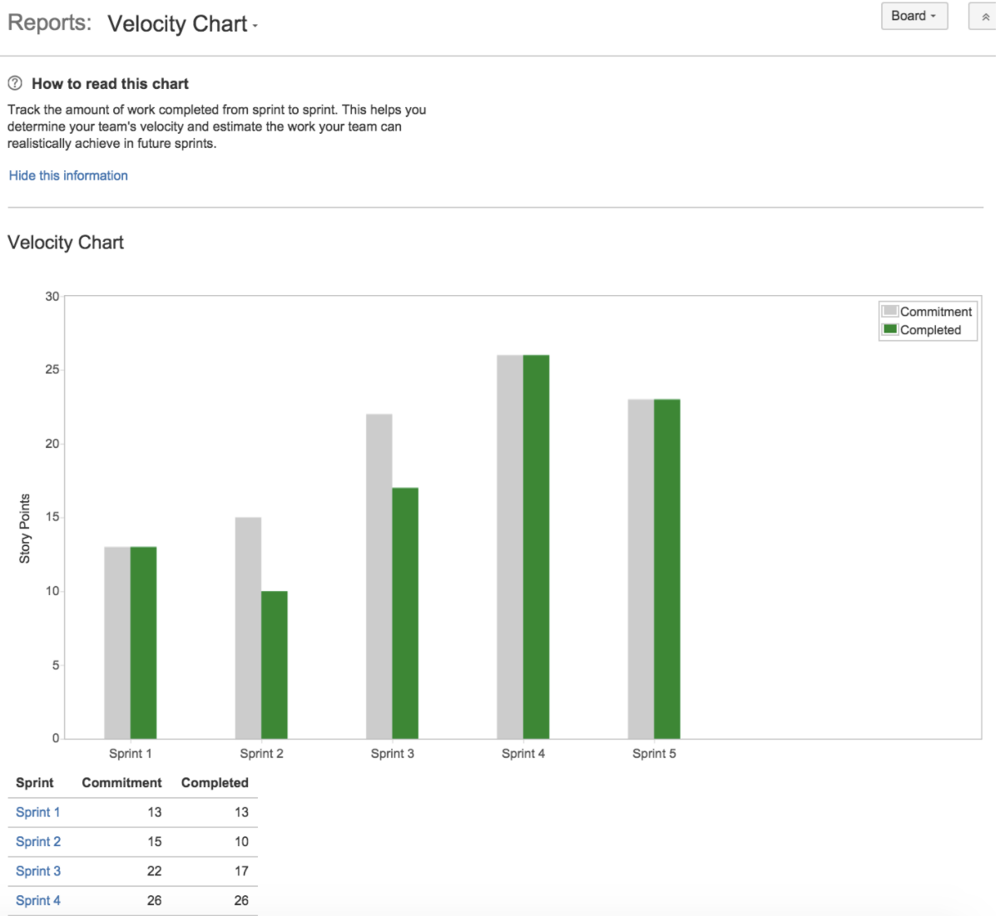
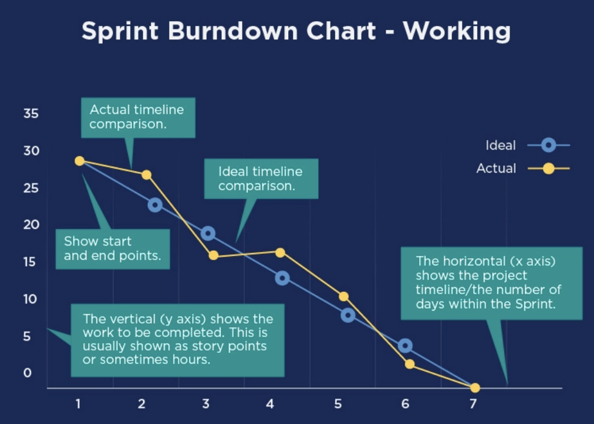

# Agile
## From Waterfall Lifecycle To Agile
- waterfall lifecycle
	- take each step sequentially and there is no going back
	- all the requirements are frozen (assume that requirements never change)

##  Agile History
- pre-2001
	- practices and methods develop independently through experience
- mid 1990s
	- software developers starting mixing old and new ideas and created methodologies that worked
- scrum, eXtreme Programming (XP), feature-driven development (FDD)

## Agile Methods For Flat Cost
- focus on whole
- people over process
- iterative
- customer involvement
- expectation that requirements will change
- simplicity

## The 4 Agile Values
- individuals and interactions over processes and tools
	- face-to-face communication with team members and customers
- working software over comprehensive documentation
	- measure of success is software not thorough documentation
- customer collaboration over contract negotiation
	- customer input throughout the project rather than at the start and conclusion
- responding to change over following a plan
	- change is the only constant
	- priorities can be shifted from iteration to iteration

## Principles Behind The Agile Manifesto
1. Our highest priority is to satisfy the customer through early and continuous delivery of valuable software.
2. Welcome changing requirements, even late in development. Agile processes harness change for the customer's competitive advantage.
3. Deliver working software frequently, from a couple of weeks to a couple of months, with a preference to the shorter timescale.
4. Business people and developers must work together daily throughout the project.
5. Build projects around motivated individuals. Give them the environment an support they need, and trust them to get the job done.
6. The most efficient and effective method of conveying information to and within a development team is face-to-face conversation.
7. Working software is the primary measure of progress.
8. Agile processes promote sustainable development. The sponsors, developers, and users should be able to maintain a constant pace indefinitely.
9. Continuous attention to technical excellence and good design enhances agility.
10. Simplicity, the art of maximizing the amount of work not done, is essential.
11. The best architectures, requirements, and designs emerge from self-organizing teams.
12. At regular intervals, the team reflects on how to become more effective, then tunes and adjusts its behavior accordingly.

# eXtreme Programming (XP)
## What Is XP?
- lightweight
- humanistic
- discipline
- software development

## XP Specifics
- incremental planning
- small releases
- simple design (just enough to meet requirements)
- test first development
- refactoring
- pair programming
- continuous integration
- on-site customer (customer is part of the team)
- requirements engineering in XP (customer -> user stories/story cards -> selected user cards -> task cards)
- testing (task cards -> unit tests; customer -> system tests)

## XP's Practices
### Thinking: Pair Programming
- one person codes (the driver)
- one person thinks (the navigator)
- works for a while then alternate
- possible disadvantage
	- productivity is cut in half (questionable)
- advantages
	- productivity rarely reduced
	- resulting code benefits from two people working together
	- code review; less interrupted; more fun

### Thinking: Root Cause Analysis
- find the root cause by asking "why?" 5 times
- real world example: when we start working on a new task, we spend a lot of time getting the code into a working state
	- why? because the build is often broken in source control
	- why? because people check in code without running their tests
	- why? because sometimes tests take longer to run than people have available
	- why? because tests spend a lot of time in database setup and teardown
	- why? because our design makes it difficult to test business logic without touching the database
	- Note: after asking "why?" 5 times, you focus on the core issue... your design

### Collaboration: Ubiquitous Language
- programmers should speak the language of their domain experts, not the other way around
- ubiquitous language in code
	- low representational gap
- should we avoid using technical jargon altogether? no
	- it is okay to use technical language in areas that are unrelated to the domain (ex. "button", "connection")

### Releasing: Done Done
- we are done when we are production ready
	- tested, coded, refactored, integrated, builds, installs, migrates, reviewed, fixed, accepted

### Planning: Stories
- 1 or 2 line descriptions of work the team should produce
- two characteristics
	- stories represent customer value
	- stories have clear completion criteria
- story or not? "automate integration build"
	- too vague completion criteria
	- no customer value (they cannot understand "integration build")
- story or not? "deploy to staging server outside the firewall"
	- doesn't have customer centric language
- story or not? "improve performance"
	- difficult to very
	- does not have a clear completion criteria
	- nonfunctional requirement

### Developing: Customer Tests
- we implement tricky domain concepts correctly
- customers have domain knowledge that programmers don't have
- customer tests help customers customers communicate their expertise
- customer tests are examples that programmers turn into automated tests

# Scrum
## Scrum History
- introduced in "The New Product Development Game" by Hirotaka Takeuchi and Ikujiro Nonaka in 1986
	- stressed importance of teamwork and some analogies between a team sport like rugby and being successful in the game of a new product development
- Jeff Sutherland and Ken Schwaber conceived the Scrum process in 1995 the OOPSLA conference

## Scrum Actors
- product owner (customer)
- team
- scrum master

## Scrum High-Level Process

- instead of using an absolute measure of time, we assign user story points

- sprint planning (first ceremony)
	- team meets and decides what they need to complete in the coming  sprint
- daily scrum stand-up meeting (second ceremony)
	- everyone is standing (idea is that you don't want to take too long because you get tired)
	- explain what you worked on yesterday, what you are working on today, and any obstacles
	- scrum master makes sure you don't talk about obstacles because otherwise it will take longer than 15 minutes
	- inspect progress towards sprint goal
- sprint review (third ceremony)
	- demo product to stakeholder/customer
	- "less than 2 hours long probably" - Professor Aibek Musaev
- retrospective (fourth ceremony)
	- what went well and didn't go well during this last sprint
	- what are we going to try in the next sprint
	- plan ways to increase quality and effectiveness
	- happens after each sprint'

## Measuring Efficacy Of The Team
### Reporting: Velocity Reports
- shows how much work was delivered in each sprint

### Reporting: Burndown Chart
- report shows how much work was done vs. expected per sprint
- a team outperforming the expected line is a nice problem to have but it means the estimation was off
	- the goal is to get the expected line as close to reality as possible

# Random Quiz
- people and their following creations

|person|creations|
|-|-|
|Kent Beck|eXtreme Programming (XP), xUnit, JUnit|
|Ward Cunningham|Wiki, technical debt|
|Ken Schwaber, Jeff Sutherland|Scrum|
|Dave Thomas|DRY|
|Robert C. Martin|SOLID principles|
|Martin Fowler|popularized "code refactoring"|