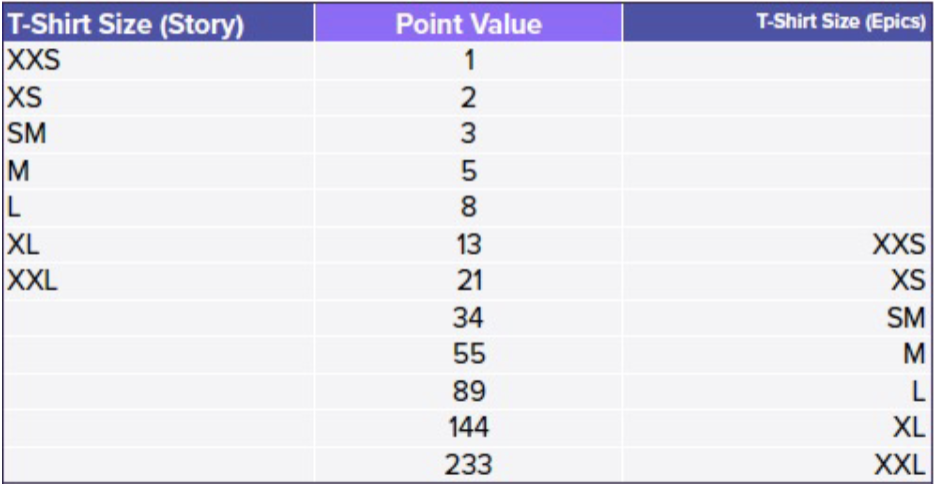
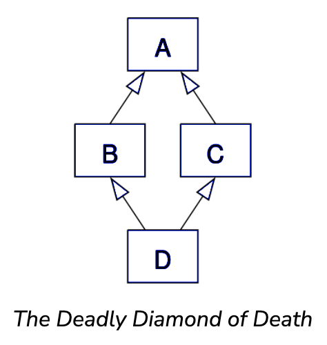
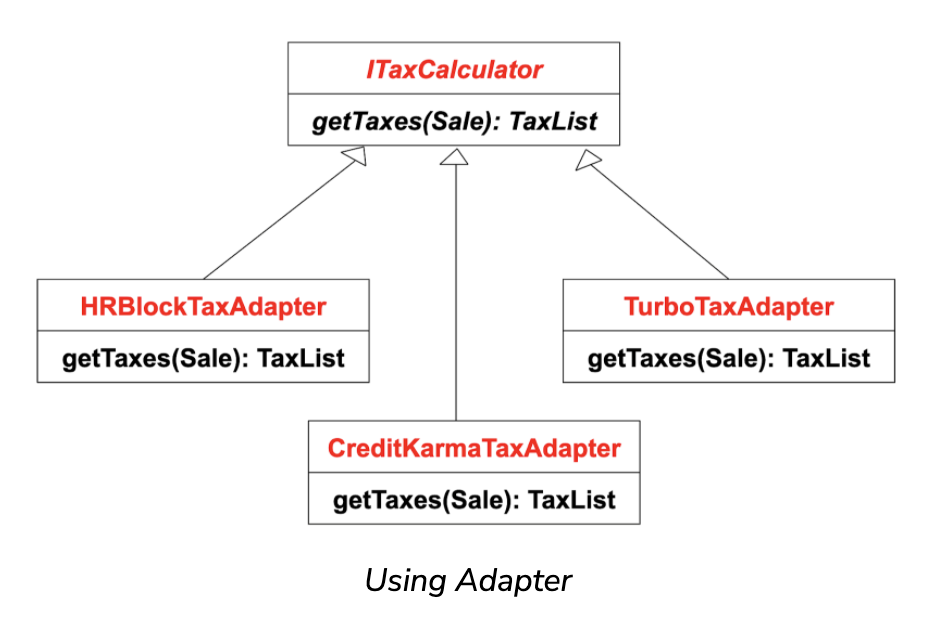
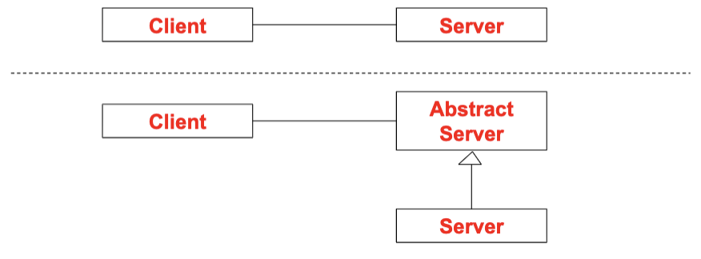

# User Story Card
- As a (user), I want (functionality), so that (benefit).
- priorities
- estimates
- ID for the user story

## Priorities
- example priorities
	- P0 (show stopper)
	- P1 (critical)
	- P2 (important)
	- P3 (nice to have)
	- P4 (low priority)

## Estimates
- Note: all estimates are wrong, but some are more wrong
- least wrong estimation technique
	- work together for a few weeks
	- get some stuff done
	- review the work
	- pick an "average" or "medium" piece of work
		- medium piece of work should be:
			- completed within a sprint
			- not too easy
			- not too hard

### Estimation: T-Shirt Sizes Estimation
- it is very hard for humans to compare absolute values, but easier to compare relative values
	- ex. pile A is heavier than pile B
- Fibonacci point values

# Dealing With Disagreements
- let people explain themselves
- hold a second voting round to converge on difficulty
- if not, then choose median

# GRASP
- General Responsibility Assignment Software Patterns (9 total - 5 basic + 4 advanced)
- basic
	- creator
	- information expert
	- low coupling
	- controller
	- high cohesion
- advanced
	- polymorphism
	- pure fabrication
	- indirection
	- protected variations

## Polymorphism
- Why does Java not support extending multiple classes?
	- Diamond Problem (Deadly Diamond Of Death)
	- you get a lattice from having multiple parents
	- the "diamond problem" is an ambiguity that arises when two classes B and C inherit from A, and class D inherits from both B and C
	- if there is a method in A that B and C have overridden, and D does not override it, then which version of the method does D inherit: that of B, or that of C?

- problem
	- how to handle alternatives based on type?
	- how to create pluggable software components?
- solution
	- when related alternatives or behaviors vary by type (class), assign responsibility for the behavior using polymorphic operations to the types for which the behavior varies
- advantages
	- easier to add additional behaviors later on
	- reduces the coupling between different functionalities
- disadvantages
	- increases the number of classes in a design
	- may make the code less easy to follow

### Polymorphism Example
- non-static methods cannot call static methods?
- `list of animals = [Dog, Cat]`

## Pure Fabrication
- when non-appropriate class is present, invent one
- problem
	- adding some responsibilities to domain objects would violate high cohesion/low coupling/reuse
- solution
	- assign a highly cohesive set of responsibilities to an artificial or convenience class that does not represent a problem domain concept (something made up, to support high cohesion, low coupling, and reuse)
- this is a compromise that often has to be made to preserve cohesion and low coupling
- the kind of class created is called a "service" in domain-driven design
- which diagram would not include any classes that result from applying pure fabrication?
	- system diagram (SD) and system sequence diagram (SSD)

### Pure Fabrication Example
- suppose `Sale` instances need to be saved in a database
	- option 1: assign this to the `Sale` class itself (Expert pattern)
		- requires that a relatively large number of supporting database-oriented operations
		- causes `Sale` class to become incohesive
	- option 2: create a new class that is solely responsible for saving objects in a persistent storage medium
		- `PersistentStorage` class has `insert(Object)` and `update(Object)`
		- `PersistentStorage` class itself is relatively cohesive
		- `PersistentStorage` class itself is generic and reusable

## Indirection
- problem
	- where to assign a responsibility to avoid direct coupling between two or more things?
	- how to decouple objects so that low coupling is supported and reuse potential remains high?
- solution
	- assign the responsibility to an intermediate object to mediate between other components or services so that they are not directly coupled
	- this intermediary creates an indirection between the other components
- a common mechanism to reduce coupling
- assign responsibility to intermediate object to decouple two components

### Indirection Example
- POS/Adapter example

- how do we replace the current calculator with a new one?
	- need to implement a new adapter with new code
	- causes a minor change (`new XAdapater() -> new YAdapter() or use Factory`)

## Protected Variations
- problem
	- how to design objects, subsystems, and systems so that variations or instabilities in the elements do not have an undesirable impact on other elements?
- solution
	- identify points of predicted variation or instability
	- assign responsibilities to create a stable interface around them
- protects one part of the code from changes in another
	- protected variations
	- open-closed principle
	- information hiding
- typical mechanisms for protection:
	- encapsulation
	- abstraction
	- polymorphism
	- indirection

### Encapsulation
- basic mechanism, typically in the programming language
- group related entities into a single unit, and provide a restricted view of the unit
- first form of encapsulation: procedures
	- encapsulates a set of statements
	- external view: name and parameters
	- protection against variations in an algorithm

#### Object-Oriented Encapsulation
- packaging of operations and attributes
- attributes represent internal state that is not directly accessible
	- hidden behind a "wall" of operations
- state is accessible and modifiable only through the operations
- protection against
	- changes in data representation
	- changes in algorithm

### Abstraction
- common theme in software design
- low-level abstractions
	- procedural abstractions (subroutines)
	- data abstractions (classes)
		- protections against variations within the class
- higher-level abstractions for object-oriented design

#### Using Abstractions
- principle: write client code against an abstraction of the server in case of current or future variations of the server

# Law Of Demeter
- don't talk to strangers (don't access unfamiliar components)
- within a method, messages should only be sent to the following objects
	- `this` or `self` object
	- a parameter of the method
	- an attribute of `this`
	- an element of a collection which is an attribute of `this`
	- an object created within the method