# Package Diagrams
- a package is a grouping of related UML elements, such as classes, other packages, use cases, etc.
	- shows dependencies between packages
	- illustrates logical architecture of the system
	- provides `static` view

## Package Diagram Notation
- packages appear as rectangles with small tabs at the top
- the package name is on the tab or inside the rectangle
- the dotted arrows are dependencies
- one package depends on another if changes in the other could possibly force changes in the first

- if the members of the packages are not shown inside the package rectangle, then the name of the package should be placed inside

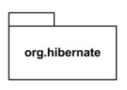

- the members of he package may be shown within the boundaries of the package
	- in this case, the name of the package should be placed on the tab

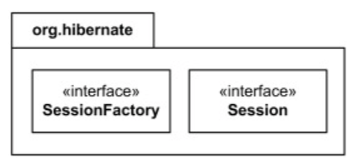

- members of the package may be shown outside of the package by branching lines from the package to the members

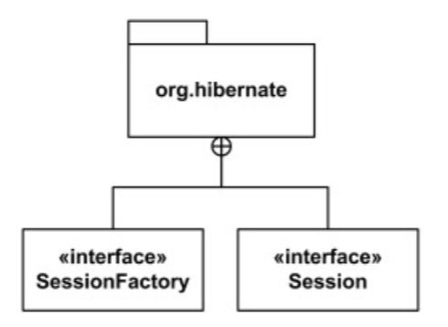

## Logical Architecture Example
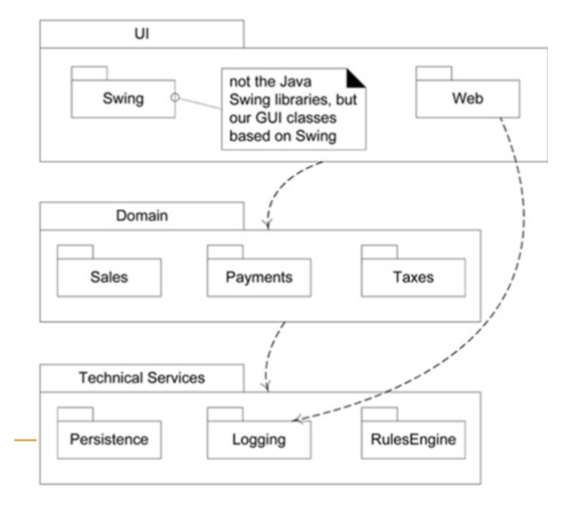

# Designing With Packages
- what is the best criteria for partitioning the classes into groups?
- what are the relationships between packages?
- top/down vs bottom/up approach?
- how are packages physically represented?
- to what purpose will we put these packages?

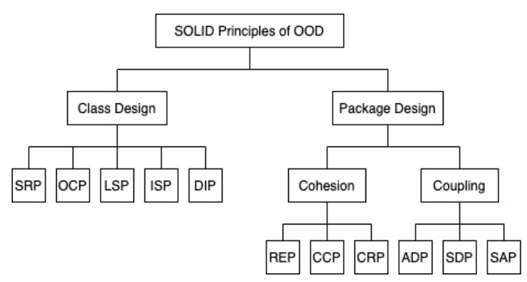

## Release-Reuse Equivalency Principle (REP)
- disadvantages of code copying
	- you own the code you copy
	- you need to maintain it (fix bugs, update it) if code changes
- what you want
	- never have to look at the source code
	- be notified about updates
	- be able to decide when to integrate changes

### REP Example
```
// the following violates REP
import Player.*;
import Armor.*;
import Weapon.*;

class Main {
	// some code using Player, Armor, Weapon
}


// the following is the solution
import GameObjects.*;

class Main {
	// some code using GameObjects (which includes Player, Armor, Weapon)
}
```

## Common Reuse Principle (CRP)
- helps decide which classes should be placed into a package
- classes that tend to be reused together belong in the same package
- why?
	- packages in Java are distributed in JAR files
	- if one package uses a class in another package even if it only uses a single method in a single class, it has a strong dependency
- how?
	- CRP says something about which classes to put in a package but mostly which classes not to put in the package

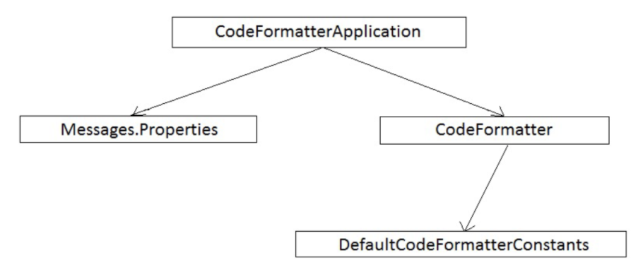

## Common Closure Principle
- if the code in an application must change, we would like changes to be focused into a single package
	- so we only need to redeploy the one changed package
- other packages that don't depend on the changed package do not need to be re-validated or redeployed

## Acyclic Dependencies Principle (ADP)
- when two are more packages are involved in a dependency cycle, it becomes very difficult to stabilize the application
- a naive automated build system can be completely defeated by a cycle in the package graph
- the following is a violation of ADP (contains a cycle)

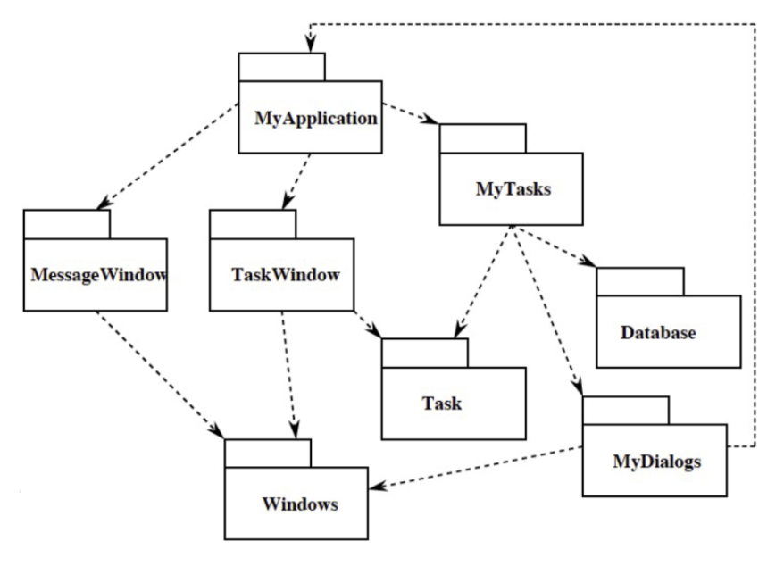

## Stable-Dependencies Principle (SDP)
- parts of the system that change frequently should depend on parts that don't change very much
- things that change a lot should have very few dependents

### Measuring Stability: I Metric
- 
	- `C-in`: the number of classes outside a package that **depend on a class inside the package**
	- `C-out`: the number of classes outside a package that **any class inside the package depends on**
- `I` value is always between 0 and 1
	- `I=0` is a highly stable package
	- `I=1` is a highly unstable package

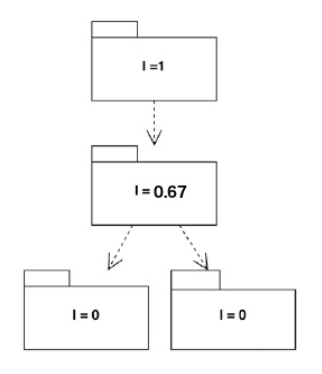

## Stable Abstractions Principle (SAP)
- stable packages should be more abstract, containing classes and modules that can be extended
- depending on concrete things (bad SAP)

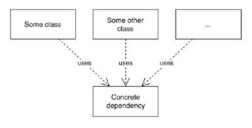

- depending on concrete things (good SAP)

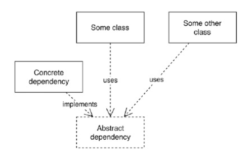

### Measuring Stability: A Metric
- 
	- `C-abstract`: the number of abstract classes and interfaces in a package
	- `C-concrete`: the number of concrete classes in a package
- `A` value is always between 0 and 1
	- `A=0` is a highly concrete package
	- `A=1` is a highly abstract package
- Note: all dependencies go in the direction of stability (`I=0`) and direction of abstractness (`A=1`)

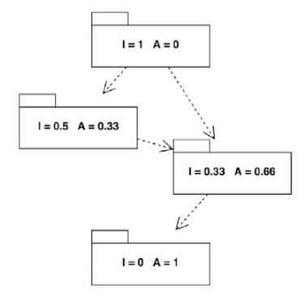