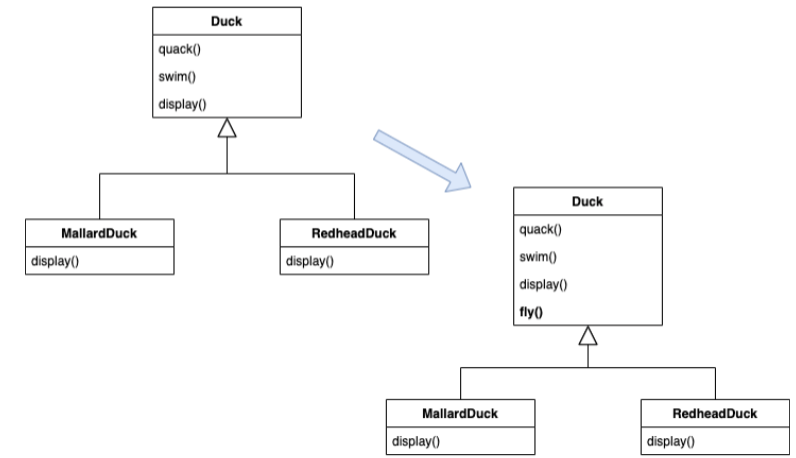
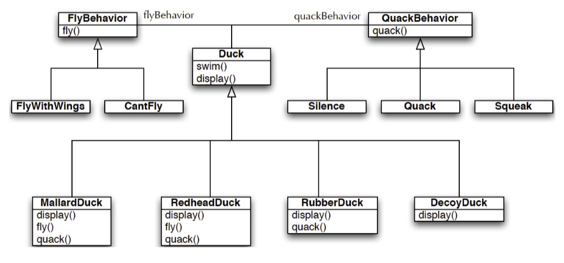

# History Of Design Patterns
- 1977: Christopher Alexander introduces the idea of patterns, a successful solution to problems
- 1987: Ward Cunningham and Kent Beck leverage Aleander's ide ain the context of an object-oriented language
- 1987: Eric Gamma's dissertation on importance of patterns and how to capture them
- 1992: Jim Coplien's book Advanced C++ Programming Styles and Idioms

# Patterns Catalog
- fundamental patterns
	- delegation pattern
	- interface pattern
	- proxy pattern
- creational patterns
	- abstract factory pattern
	- factory method pattern
	- lazy initialization pattern
	- singleton pattern
- structural patterns
	- adapter pattern
	- bridge pattern
	- decorator pattern
- behavioral patterns
	- chain of responsibility pattern
	- iterator pattern
	- observer pattern
	- strategy pattern
	- visitor pattern
- concurrency patterns
	- active object
	- monitor object
	- thread pool pattern

# SimUDuck App
- **SimUDuck**: a "duck pond simulator" that can show a wide variety of duck species swimming and quacking
- we can add `fly()` to all ducks (now all ducks can fly)



- we want to add `RubberDuck` but it doesn't `quack()` or `swim()` so how do we override inherited methods to fix that?

## First Design Principle
- identify aspects of your application that vary and separate them from what stays the same
- take what varies and encapsulate it so it won't affect the rest of your code
- results in fewer unintended consequences from code changes and more flexibility in your systems

# Second Design Principle
- program to an interface/supertype, not an implementation
- ex.
```
// programming to an implementation
Dog dog = new Dog();
d.bark();

// but cats don't bark...

// programminng to an interface/supertype
Animal animal = new Dog();
animal.makeSound();

// even better is
a = getAnimal();
a.makeSound();
```
- abstract supertype could be an abstract class or interface



# Third Design Principle
- favor composition over inheritance
- creating systems using composition provides more flexibility
	- allows you to encapsulate a family of algorithms
	- allows you to change behavior at runtime

# Strategy Pattern
- **strategy pattern**: defines a family of algorithms, encapsulates each one, and makes them interchangeable
	- lets the algorithm vary independently from clients that use it
- what is the difference between strategy pattern and dependency injection?
	- **dependency injection**: transferring the task of creating the object to someone else and directly using the dependency

## Importance Of Shared Vocabulary
- design patterns are important because they provide a shared vocabulary to software design
	- in addition to being really useful solutions to tricky problems
- “I used the observer design pattern” vs. stating a long list of features (notify listeners every time data changes, dynamic, loosely coupled, etc.)