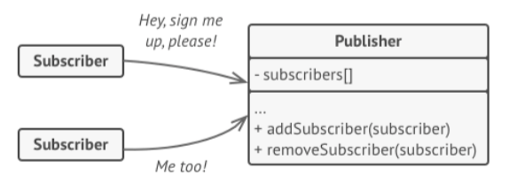
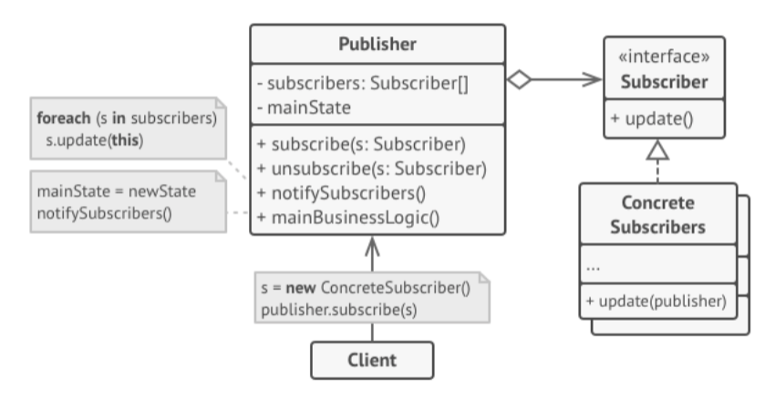

# Observer Pattern
- intent
	- observer is a behavioral design pattern that lets you define a subscription mechanism to notify multiple objects about any events that happen to the object they're observing

- you don't want to couple the publisher to all the subscriber classes...
	- so have all subscribers implement the same interface and that the publisher communicates with them through that interface

- Note: the relationship to the observer is 1-to-many

# Applicability
- when changes to the state of one object may require changing other objects, and the actual set of objects is unknown beforehand or changes dynamically
- when some objects in your app must observe others, but only for a limited time or in specific cases

# Design Principles In Action
- protected variations
	- you can vary the `Observers` without changing the `Subject`
- program to an interface/supertype, not an implementation
	- both `Subject` and `Observer` use interfaces
- favor composition over inheritance
	- relationship between `Observers` and `Subject` is set up at runtime by composition

# Demo
- 3 approaches
	- implement it ourselves
	- implement it with `Observer` (deprecated)
	- implement it with `PropertyChangeListener` (preferred)