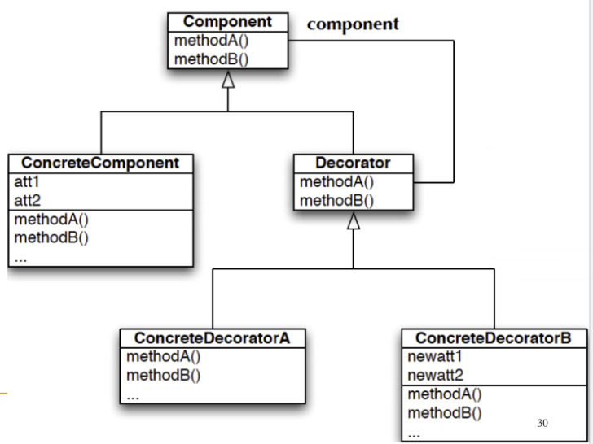
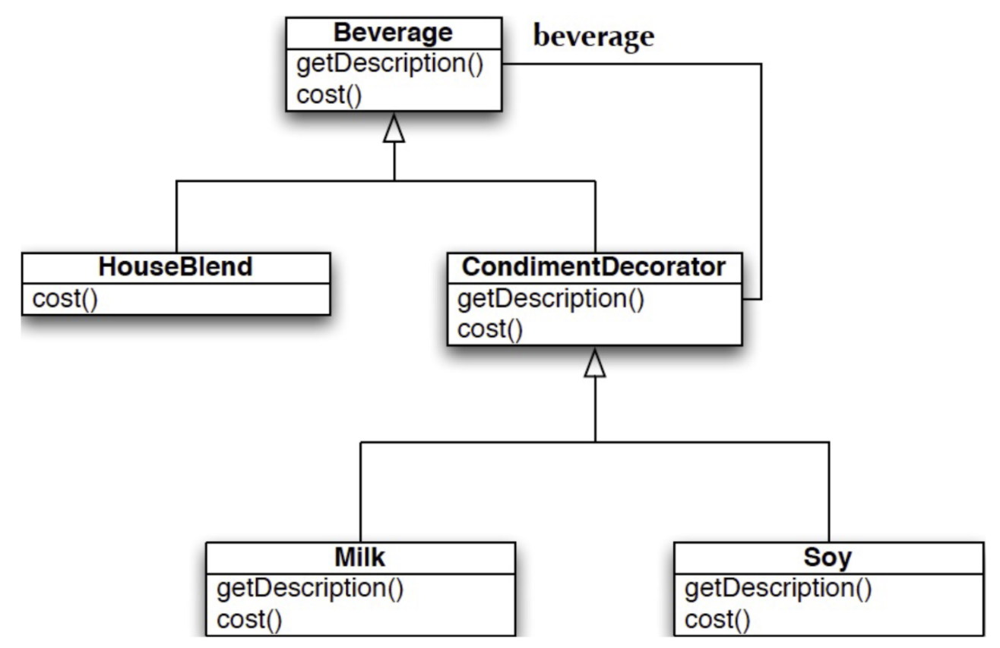

# Decorator Pattern
- intent
	- **decorator**: a structural design pattern that lets you attach new behaviors to objects by placing these objects inside special wrapper objects that contain the behaviors
	- wrapping is just a fancy way of saying "delegation" with the added twist that the delegator and the delegate both implement the same interface
- **open-closed principle**: classes should be open to extension but closed to modification
	- decorator allows modification without changes to existing code for a class, but runtime behavior can be extended
	- inheritance is a solution, but composition and delegation are more flexible

- real world analogy
	- wearing clothes is an example of using decorators

## Starbuzz Coffee Example
- under pressure to update their "point of sale" syse mto keep up with their expanding set of beverage products
	- started with a Beverage abstract base class and four implementations HouseBlend, DarkRoast, Decaf, and Espresso
- but they also offer condiments including steamed milk, soy, and mocha
	- these condiments alter a beverage's description and cost
- approach 1 (bad solution)
	- one subclass per combination
		- there will be too many combinations of beverages
- approach 2 (bad solution)
	- let beverage handle condiments
		- price changes alter the existing code
		- adding a new condiment alters cost in super class
		- new beverages may not use some condiments
		- cannot double up on condiments
- approach 3 (good solution)
	- use decorators

