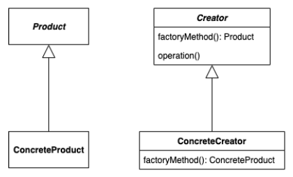
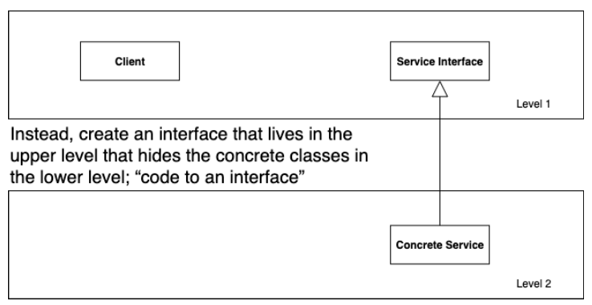

# The Problem With `New`
- each time we invoke `new` to create a new object, we violate the "code to interface" design principle
```
Duck duck = new MallardDuck();
```

- we have a set of concrete classes and we don't know until runtime which one we need to instantiate
```
Duck duck;

if (picnic) {
	duck = new MallardDuck();
} else if (hunting) {
	duck = new DecoyDuck();
} else if (inBathTub) {
	duck = new RubberDuck();
}
```

# Framework For Pizza Store
- suppose we have a pizza store that makes pizzas

```
Pizza orderPizza() {
	Pizza pizza = new Pizza();
	
	pizza.prepare();
	pizza.bake();
	pizza.cut();
	pizza.box();
	
	return pizza;
}
```

- what if we want more than one type of pizza

```
Pizza orderPizza() {
	Pizza pizza;
	
	if (type.equals("cheese")) {
		pizza = new CheesePizza();
	} else if (type.equals("greek")) {
		pizza = new GreekPizza();
	} else if (type.equals("pepperoni")) {
		pizza = new PepperoniPizza();
	}
	
	pizza.prepare();
	pizza.bake();
	pizza.cut();
	pizza.box();
	
	return pizza;
}
```

- a simple solution is to encapsulate creation code and put it in a separate class
	- the new class depends on the concrete classes, but those dependencies no longer impact the code preparation

```
public class SimplePizzaFactory {
	public Pizza createPizza(String type) {
		if (type.equals("cheese")) {
			return new CheesePizza();
		} else if (type.equals("greek")) {
			return new GreekPizza();
		} else if (type.equals("pepperoni")) {
			return new PepperoniPizza();
		}
	}
}

public class PizzaStore {
	private SimplePizzaFactory factory;
	
	public PizzaStore(SimplePizzaFactory factory) {
		this.factory = factory;
	}
	
	Pizza orderPizza(String type) {
		Pizza pizza = factory.createPizza(type);
		
		pizza.prepare();
		pizza.bake();
		pizza.cut();
		pizza.box();

		return pizza;
	}
}
```

# Factory Method
- factory method design pattern defines an interface for creating an object but lets subclasses decide which class to instantiate
- factory method lets a class defer instantiation to subclasses



# Dependency Inversion Principle (DIP)


- instead of having a client class in the upper level of our design depending on a concrete class that is lower in the design
	- create an interface that lives in the upper level that hides the concrete classes in the lower level ("code to interface")
- factory method is one way of following DIP
	- depend upon abstractions
	- do not depend upon concrete classes
- normally "high-level" classes depend on "low-level" classes
	- instead they both should depend on an abstract interface
