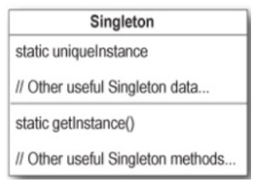

# Singleton Pattern
- a creational design pattern
- it is used to ensure that only one instance of a particular class ever gets created and that there is just one (global) way to gain access to that instance
- consists of:
	- a private constructor
	- a private static instance variable to store instance
	- a public static method to gain access to the instance
		- creates the object if needed, and returns



- singleton only involves one single class (includes attributes and methods)
- the class has a static variable that points at a single instance of the class
- the class has a private constructor (to prevent other code from instantiating this class) and a static method that provides access to the single instance

## Deriving Singleton (I)
```
public class MyClass {
	// attributes
	// constructors
	// methods
}

MyClass c = new MyClass();
```

- problem: unlimited instantiation
	- as long as a client object "knows about" the name of class `MyClass`, it can create instances of `MyClass` (because the constructor is public)
	- `MyClass c = new MyClass();`
- solution:
	- make the constructor private

## Deriving Singleton (II)
```
public class MyClass {
	private MyClass() {}
	
	// attributes
	// constructors
	// methods
}
```
- now `MyClass c = new MyClass();` is impossible to class by any method outside of `MyClass`
- problem: no point of access
	- now that the constructor is private, no class can gain access to instances of `MyClass`
	- but our requires were that there would be at least one way to get access to an instance of `MyClass`
- solution:
	- create a static method that gets the instance

## Deriving Singleton (III)
```
public class MyClass {
	private MyClass() {}
	
	public static MyClass getInstance() {
		return new MyClass();
	}
	
	// attributes
	// constructors
	// methods
}
```
- problem: back to unlimited instantiation
	- we are back to the problem where any client can create an instance of MyClass using `MyClass c = MyClass.getInstance();`
- solution:
	- need a static variable to store that instance (to ensure only one instance is ever created)

## Deriving Singleton (IV)
```
public class MyClass {
	private static MyClas myClass;

	private MyClass() {}
	
	public static MyClass getInstance() {
		return new MyClass;
	}
	
	// attributes
	// constructors
	// methods
}
```
- problem: no instance
	- now the `getInstance` method returns null when it is called
- solution:
	- check if the instance variable to see if it is null
		- if null, then create an instance
		- otherwise, return the single instance

## Deriving Singleton (V)
```
public class MyClass {
	private static MyClass myClass;

	private MyClass() {}
	
	public static MyClass getInstance() {
		if (myClass == null) {
			myCLass = new MyClass();
		}
		return new MyClass;
	}
	
	// attributes
	// constructors
	// methods
}
```

# Thread Safe? No
- the Java code just shown is not thread safe
	- means that it os possible for two threads to attempt to create the singleton for the first time simultaneously
	- if both threads check to see if the static variable is empty at the same time, they will both proceed to creating an instance and you will end up with two instances of the singleton object (NOT GOOD)

## Dealing With Multithreading (I)
- make `getInstance` method a synchronized method
```
public class Singleton {
	private static Singleton uniqueInstance;
	
	private Singleton() {}
	
	public static synchronized Singleton getInstance() {
		if (uniqueInstance == null) {
			uniqueInstance = new Singleton();
		}
		return uniqueInstance;
	}
}
```

## Dealing With Multithreading (II)
- move to an eagerly created instance rather than a lazily created one
```
public class Singleton {
	private static Singleton uniqueInstance = new Singleton();
	
	private Singleton() {}
	
	public static synchronized Singleton getInstance() {
		return uniqueInstance;
	}
}
```

## Dealing With Multithreading (III)
- use "double-checked locking" to reduce the use of synchronization in `getInstance()`
```
public class Singleton {
	private static Singleton uniqueInstance;
	
	private Singleton() {}
	
	public static synchronized Singleton getInstance() {
		if (uniqueInstance == null) {
			synchronized (Singleton.class) {
				if (uniqueInstance == null) {
					uniqueInstance = new Singleton();
				}
			}
		}
		return uniqueInstance;
	}
}
```