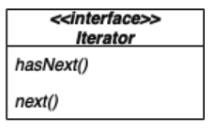

# `Collections` In Programming Languages
- `Collections` are ubiquitous in programming languages
	- arrays, stacks, queues, lists, hash tables, trees, etc.
- you don't want to expose the details of the collections that your class uses
	- increases coupling

# Iterator Pattern
- a behavioral design pattern that provides a common interface for traversing the items of an aggregate, allowing you to use polymorphism when writing code that makes use of the items of the aggregate
- provides a way to access elements of an aggregate object sequentially without exposing its underlying representation
- places the task of traversal on the iterator object, not on the aggregate



# Single Responsibility Principle (SRP)
- a class should only have one reason to change
- SRP dictates that collections should not implement traversals
	- collections focus on storing members and providing access to them
	- an iterator focuses on looping over the members of a collection

# PancakeHouse And Diner Example
- PancakeHouse uses `ArrayList` to store its menu items
- Diner uses `Array` to store its menu items
- `ArrayList` and `Array` have differences in checking size and retrieving items, sow e use an `Iterator`

```
public class Waitress {
	PancakeHouseMenu pancakeHouseMenu;
	DinerMenu dinerMenu;
	
	public Waitress(PancakeHouseMenu pancakeHouseMenu, DinerMenu dinerMenu) {
		this.pancakeHouseMenu = pancakeHouseMenu;
		this.dinerMenu = dinerMenu;
	}
	
	public void printMenu() {
		Iterator pancakeIterator = pancakeHouseMenu.createIterator();
		Iterator dinerIterator = dinerMenu.creatorIterator();
		
		System.out.println("MENU\n----\nBREAKFAST");
		printMenu(pancakeIterator);
		System.out.println("\nLUNCH");
		printMenu(dinerIterator);
	}
	
	private void printMenu(Iterator iterator) {
		while(iterator.hasNext()) {
			Menu menuItem = (MenuItem) iterator.next();
			System.out.println(menuItem.getName() + ", ");
			System.out.println(menuItem.getPrice() + "-- ");
			System.out.println(menuItem.getDescription());
		}
	}
}
```
