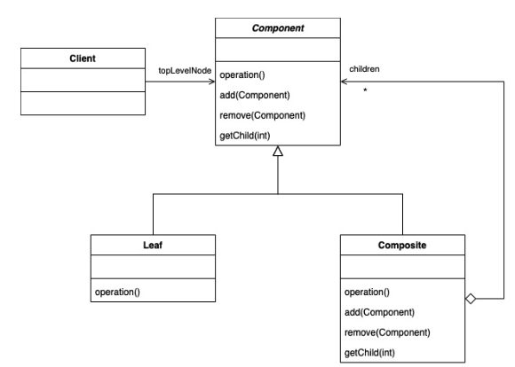

# Composite Pattern
- a structural design pattern that allows us to build structures of objects in the form of trees that contain both objects and other composites
- ex. grouping objects in a vector drawing tool
	- you can create an individual shape and apply operations to it: `move()`, `scale()`, `rotate()`, etc.
	- you can create a group of objects and apply the same operations to it: `move()`, `scale()`, `rotate()`, etc.

- you have the `Leaf` return a NullIterator which has a `hasNext()` method that always returns false
- add `createIterator` method to the `Component`, then you can implement the traversal that you want
- Note: iterator pattern separates the management of a collection from the traversal of a collection
- Note: composite pattern allows individual objects and groups of objects to be treated uniformly