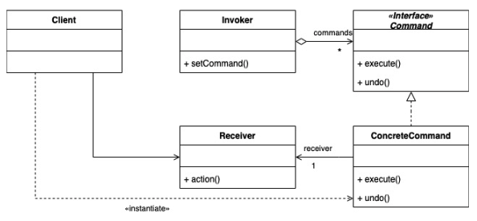

# Separation Of Concerns
- ex. we have many objects that we need to control with a remote (light, ceiling fan, stereo, faucet, thermostat) which may have many diverse methods (`dim()`, `setTemperature()`, `setVolume()`, etc.)
	- we need to be able to turn each device "on" or "off"
	- we need to be able to undo the last action for any device
- the `Vendor` class
	- one (or more) methods that define "on"
	- one (or more) methods that define "off"
- the `Command`
	- send a message to a device ("on" or "off")
	- handle the undo of a message
	- possible future enhancements
		- ex. logging request, queue request, etc.
- the `Remote`
	- handles one or more `Commands`
	- doesn't know anything about `Vendor` class specifics

# Command Pattern
- a behavioral design pattern
	- encapsulates a request to do something
	- converts an operation to an object
	- "allows you to decouple the requester of the action from the object that performs the action"
- can be used to implement undo/redo
- can assemble a set of simple commands into a complex one
- can be used to implement deferred execution of operations

# Code Example
```
// Command interface
public interface Command {  
	void execute();  
	void undo();  
}
```

```
// Vendor class
public class Light {
	publi void on() {}
	public void off() {}
}
```

```
// Command class
public class LightOnCommand implements Command {
	Light light;
	
	public LightOnCommand(Light light) {
		this.light = light;
	}
	
	public void execute() {
		light.on;
	}
}
```

```
public class SimpleRemoteControl {
	Command slot;
	
	public SipmleRemoteControl() {}
	
	public void setCommand(Command command) {
		slot = command;
	}
	
	public void buttonWasPressed() {
		slot.execute();
	}
}
```

```
public class RemoteControlTest {
	public static void main(String[] args) {
		SimpleRemoteControl remote = new SimpleRemoteControl();
		Light light = new Light();
		LightOnCommand lightOn = new LightOnCommannd(light);
		
		remote.setCommand(lightOn);
		remote.buttonWasPressed();
	}
}
```

- GoF (Group of Four) intent
	- encapsulates a request as an object, letting you parameterize other objects with different requests, queue, or log requests, and support undoable operations
- participants
	- Client (RemoteControlTest) - creates command and associates command with receiver
	- Receiver (Light, TV, etc.) - knows how to perform the work
	- Concrete Command (LightOnCommand) - implementation of Command interface
	- Command Interface - defines interface for all commands
	- Invoker (RemoteControl) - holds reference to a command and calls `execute()`



# Adding Undo
1. define an `undo()` method in the `Command` interface
2. implement an `undo()` method in both the specified "on" and "off" Command classes
3. 

# Macro Commands
1. create Commands
2. create "on" and "off" arrays and two macros to hold them (pass each array into a separate macro commannd)
3. assign macro commands to a button
4. push buttons

```
public class MacroCommand implements Command {
	Commannd[] commands;
	
	public MacroCommand(Command[] commands) {
		this.commands = commands;
	}
	
	public void execute() {
		for (int i = 0; i < command.length; i++) {
			commands[i].execute();
		}
	}
}

```